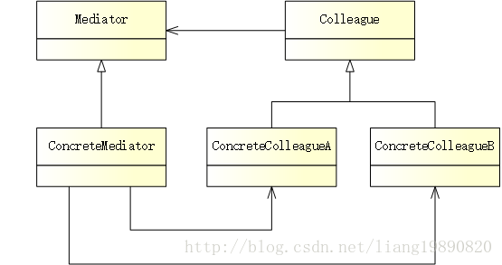

# 中介者模式

## 简述
中介者模式（Mediator Pattern）用一个中介对象来封装一系列的对象交互。中介者使各对象不需要显式地相互引用，从而使其耦合松散，而且可以独立地改变它们之间的交互。

模式结构
UML 结构图：



- Mediator（抽象中介者）：为 Colleague 对象之间的通信定义接口。
- ConcreteMediator（具体中介者）：实现 Mediator 接口，并需要了解和维护各个 Colleague 对象，负责协调他们之间的通信。
- Colleague（抽象同事类）：定义与其他 Colleague 通信的接口。
- ConcreteColleague （具体同事类）：实现 Colleague 接口，并通过 Mediator 与其他 Colleague 进行沟通。
- 中介者是对象的通信中心。当一个对象需要与另一个对象通信时，它不会直接调用另一个对象。相反，它会调用中介者对象，其主要职责是将消息路由到目标对象。它允许开发人员不必管理对象之间的链接。

## 优缺点
优点：

- 中介者模式简化了对象之间的交互，它用中介者和同事的一对多交互代替了原来同事之间的多对多交互，一对多关系更容易理解、维护和扩展，将原本难以理解的网状结构转换成相对简单的星型结构。
- 中介者模式可将各同事对象解耦。中介者有利于各同事之间的松耦合，可以独立地改变和复用每一个同事和中介者，增加新的中介者和新的同事类都比较方便，更好地符合“开闭原则”。
- 可以减少子类生成，中介者将原本分布于多个对象间的行为集中在一起，改变这些行为只需生成新的中介者子类即可，这使各个同事类可被重用，无须对同事类进行扩展。

缺点：

- 如果存在大量同事之间的交互，中介者将会变得非常复杂，使得系统难以维护。

## 适用场景
- 系统中对象之间存在比较复杂的引用关系，导致它们之间的依赖关系结构混乱而且难以复用该对象。
- 想通过一个中间类来封装多个类中的行为，而又不想生成太多的子类。

## 案例分析
中介 - 客户与房东之间的桥梁


说起中介，很多人第一印象是房产中介，专门负责新房、二手房买卖、以及租房等业务。

奔波在一线城市的人，想必都经历过找房的辛酸（北漂的我默默地路过），不通过中介，想找到一个合适的小窝？不存在的。。。社区驻守、客户介绍、网络拓客、花钱买房源信息，对于中介来说，这些简直都是轻车熟路，房源哪里逃！更可怕的是，前一秒是独家，下一秒就是千百家。

这里，中介是对象的通信中心。当房东需要与租客通信时，他们之间不会直接交互，而是通过中介将消息发送给目标对象。

## 代码实现
创建抽象中介者

由于中介需要和所有参与者打交道，所以它除了注册参与者之外，还需要将发送者的消息传递出去：
```cpp 
// mediator.h
#pragma once

#include "colleague.h"
#include <list>

class IColleague;

// 抽象中介者
class IMediator
{
public:
    // 注册参与者
    virtual void registerColleague(IColleague* colleague) { m_colleagues.emplace_back(colleague); }
    const std::list<IColleague*>& getColleagues() const { return m_colleagues; }

    // 将发送者的消息发送给所有参与者
    virtual void distributeMessage(const IColleague* sender, const std::string& message) const = 0;

private:
    std::list<IColleague*> m_colleagues;
};
```

创建具体中介者

具体中介者的职责是遍历所有的参与者，将发送者的消息通知到每一个人：
```cpp
// concrete_mediator.h
#ifndef CONCRETE_MEDIATOR_H
#define CONCRETE_MEDIATOR_H

#include "mediator.h"

// 具体中介者
class ConcreteMediator : public IMediator
{
public:
    // 将发送者的消息发送给所有参与者（但不包括发送者自己）
    virtual void distributeMessage(const IColleague* sender, const std::string& message) const override {
        for (const IColleague* c : getColleagues())
            if (c != sender)  // 不要将消息发送给自己
                c->receiveMessage(sender, message);
    }
};

#endif // CONCRETE_MEDIATOR_H
```

注意： 这里需要添加限制 c != sender，防止将消息回传给发送者自己。

创建抽象同事

由于房东和租客均由同事类表示，所以既需要（房东）发送消息，又需要（租客）接收消息：

```cpp
// colleague.h
#pragma once

#include "mediator.h"
#include <string>

class IMediator;

// 抽象同事类
class IColleague
{
public:
    IColleague(const std::string& name) : m_strName (name) {}
    std::string getName() const { return m_strName; }

    // 通过中介者，将自己的消息发布出去
    virtual void sendMessage(const IMediator& mediator, const std::string& message) const = 0;
    // 接收来自发送者的消息
    virtual void receiveMessage(const IColleague* sender, const std::string& message) const = 0;

private:
    std::string m_strName;
};
```

创建具体同事

在内部，具体的消息发送由中介者完成：
```cpp
// concrete_colleague.h
#ifndef CONCRETE_COLLEAGUE_H
#define CONCRETE_COLLEAGUE_H

#include "colleague.h"
#include <iostream>

// 具体同事类
class ConcreteColleague : public IColleague
{
public:
    using IColleague::IColleague;

    // 通过中介者，将自己的消息发布出去
    virtual void sendMessage(const IMediator& mediator, const std::string& message) const override {
        mediator.distributeMessage(this, message);
    }

private:
    // 接收来自发送者的消息
    virtual void receiveMessage(const IColleague* sender, const std::string& message) const override {
        std::cout << getName() << " received the message from "
                  << sender->getName() << ": " << message << std::endl;
    }
};

#endif // CONCRETE_COLLEAGUE_H
```


创建客户端

找房啦！一旦房东将房子挂出去，中介便会通知所有需要租房的人：
```cpp
// main.cpp
#include "concrete_colleague.h"
#include "concrete_mediator.h"

#ifndef SAFE_DELETE
#define SAFE_DELETE(p) { if(p){delete(p); (p)=NULL;} }
#endif

int main()
{
    // 房东
    IColleague *landlord = new ConcreteColleague("Tom");

    // 租客
    IColleague *jerry = new ConcreteColleague("Jerry");
    IColleague *tuffy = new ConcreteColleague("Tuffy");
    
    // 中介者 - 添加租客
    ConcreteMediator mediator;
    mediator.registerColleague(jerry);
    mediator.registerColleague(tuffy);
    
    // 房东通过中介将消息发送出去
    landlord->sendMessage(mediator, "Xi'erqi, two bedroom house, 6000/month.");
    
    SAFE_DELETE(jerry);
    SAFE_DELETE(tuffy);
    
    getchar();
    
    return 0;
}
```


输出如下：
```
Jerry received the message from Tom: Xi’erqi, two bedroom house, 6000/month. 
Tuffy received the message from Tom: Xi’erqi, two bedroom house, 6000/month.


```