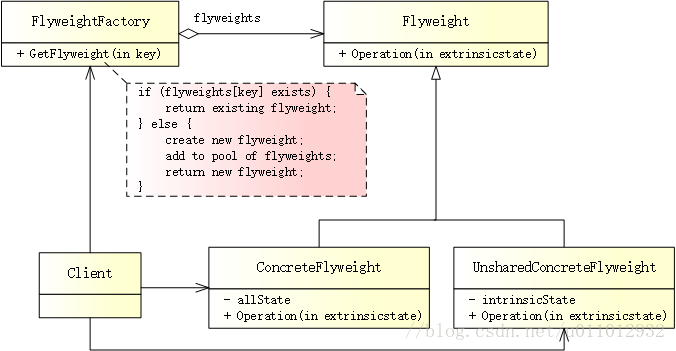

# 享元模式

## 简述

> 享元模式（Flyweight Pattern）运用共享技术有效地支持大量细粒度对象的复用。系统只使用少量的对象，而这些对象都很相似，状态变化很小，可以实现对象的多次复用。


## 模式结构
UML 结构图：



- Flyweight（抽象享元类）：通常是一个抽象类，在抽象享元类中声明了具体享元类公共的方法，这些方法可以向外界提供享元对象的内部数据（内部状态），同时也可以通过这些方法来设置外部数据（外部状态）。
- ConcreteFlyweight（具体享元类）：实现了抽象享元类，其实例称为享元对象；在具体享元类中为内部状态提供了存储空间。通常可以结合单例模式来设计具体享元类，为每一个具体享元类提供唯一的享元对象。
- UnsharedConcreteFlyweight（非共享具体享元类）：并不是所有抽象享元类的子类都需要被共享，不能被共享的子类可设计为非共享具体享元类，当需要一个非共享具体享元类的对象时可以直接通过实例化创建。
- FlyweightFactory（享元工厂类）：用于创建并管理享元对象，它针对抽象享元类编程，将各种类型的具体享元对象存储在一个享元池中，享元池一般设计为一个存储“键值对”的集合（也可以是其他类型的集合），可以结合工厂模式进行设计；当用户请求一个具体享元对象时，享元工厂提供一个存储在享元池中已创建的实例或者创建一个新的实例（如果不存在的话），返回新创建的实例并将其存储在享元池中。

## 优缺点
优点：

- 可以极大减少内存中对象的数量，使得相同或相似对象在内存中只保存一份，从而可以节约系统资源，提高系统性能。
- 享元模式的外部状态相对独立，而且不会影响其内部状态，从而使得享元对象可以在不同的环境中被共享。

缺点：

- 享元模式使得系统变得复杂，需要分离出内部状态和外部状态，这使得程序的逻辑复杂化。
- 为了使对象可以共享，享元模式需要将享元对象的部分状态外部化，而读取外部状态将使得运行时间变长。

## 适用场景
- 一个系统有大量相同或者相似的对象，造成内存的大量耗费。
- 对象的大部分状态都可以外部化，可以将这些外部状态传入对象中。
- 在使用享元模式时，需要维护一个存储享元对象的享元池，而这需要耗费一定的系统资源。因此，应当在需要多次重复使用享元对象时才值得使用享元模式。

## 案例分析
《反恐精英》 - Counter Strike

CS 将玩家分为“恐怖份子”（Terrorists）与“反恐精英”（Counter Terrorists）两个阵营，每个队伍必须在地图上进行多回合的战斗。在“爆破模式”中，T 阵营的任务是在指定时间内装置 C4 并引爆，而 CT 阵营的任务是拆除被装置的 C4。当玩家请求武器时，系统会为其分配所需的武器。

现在，有 n 个玩 CS 的玩家，如果创建 n 个对象（每个玩家一个），这势必会占用大量内存。为了解决这个问题，可以使用享元模式（减少玩家数量），只需要为恐怖分子和反恐精英创建两个对象，在需要时反复使用即可。

### 内部状态和外部状态
享元对象之所以能做到共享，关键是区分了内部状态和外部状态：

- 内部状态（Intrinsic State）：存储在享元对象内部，并且不会随环境改变而改变。因此，内部状态可以共享。 
- 这里的“任务”就是两种类型玩家的内部状态，不会随外部环境的变化而变化。无论在任何环境下，T 的任务永远是装置 C4 并引爆，而 CT 的任务永远是拆除 C4。

- 外部状态（Extrinsic State）：随环境改变而改变的、不可以共享的状态。享元对象的外部状态通常由客户端保存，并在享元对象被创建之后，需要使用时再传入到享元对象内部。一个外部状态与另一个外部状态之间是相互独立的。 
比如“武器”，每个玩家都可以携带自己选择的任何武器。有的玩家用的是 AK-47，有的则用的是沙漠之鹰。

由于区分了内部状态和外部状态，因此可以将具有相同内部状态的对象存储在享元池中来实现共享。当需要时，将对象从享元池中取出以实现对象的复用。通过向取出的对象注入不同的外部状态，可以得到一系列相似的对象，而这些对象在内存中实际上只存储一份。

## 代码实现
创建抽象享元类

在享元类中，要将内部状态和外部状态分开处理。通常将内部状态作为享元类的成员变量，而外部状态通过注入的方式添加到享元类中：
```cpp
// flyweight.h
#ifndef FLYWEIGHT_H
#define FLYWEIGHT_H

#include <iostream>
#include <string>

// 玩家 - 有武器和使命
class IPlayer
{
public:
    virtual ~IPlayer() {}

    // 分配武器
    virtual void assignWeapon(std::string weapon) = 0;
    
    // 使命
    virtual void mission() = 0;

protected:
    std::string m_task; // 内部状态
    std::string m_weapon; // 外部状态
};

#endif // FLYWEIGHT_H
```

创建具体享元类

具体享元类有两个 - Terrorist、CounterTerrorist：
```cpp
// concrete_flyweight.h
#ifndef CONCRETE_FLYWEIGHT_H
#define CONCRETE_FLYWEIGHT_H

#include "flyweight.h"

// 恐怖分子
class Terrorist : public IPlayer
{
public:
    Terrorist() {
        m_task = "Plant a bomb";
    }

    virtual void assignWeapon(std::string weapon) override {
        m_weapon = weapon;
    }
    
    virtual void mission() override {
        std::cout << "Terrorist with weapon " + m_weapon + "," + " Task is " + m_task << std::endl;
    }
};

// 反恐精英
class CounterTerrorist : public IPlayer
{
public:
    CounterTerrorist() {
        m_task = "Diffuse bomb";
    }

    virtual void assignWeapon(std::string weapon) override {
        m_weapon = weapon;
    }
    
    virtual void mission() override {
        std::cout << "Counter Terrorist with weapon " + m_weapon + "," + " Task is " + m_task << std::endl;
    }
};

#endif // CONCRETE_FLYWEIGHT_H
```

创建享元工厂

享元工厂的作用在于提供一个用于存储享元对象的享元池，当需要对象时，首先从享元池中获取，如果不存在，则创建一个新的享元对象，将其保存至享元池中并返回：
```cpp
// flyweight_factory.h
#ifndef FLYWEIGHT_FACTORY_H
#define FLYWEIGHT_FACTORY_H

#include "concrete_flyweight.h"
#include <map>

// 用于获取玩家
class PlayerFactory
{
public:
    // 如果 T/CT 对象存在，则直接从享元池获取；否则，创建一个新对象并添加到享元池中，然后返回。
    static IPlayer* getPlayer(std::string type)
    {
        IPlayer *p = NULL;
        if (m_map.find(type) != m_map.end()) {
            p = m_map[type];
        }
        else {
            // 创建 T/CT 对象
            if (type == "T") {
                std::cout << "Terrorist Created" << std::endl;
                p = new Terrorist();
            }
            else if (type == "CT") {
                std::cout << "Counter Terrorist Created" << std::endl;
                p = new CounterTerrorist();
            }
            else {
                std::cout << "Unreachable code!" << std::endl;
            }
            // 一旦创建，将其插入到 map 中
            m_map.insert(std::make_pair(type, p));
        }
        return p;
    }

private:
    // 存储 T/CT 对象（享元池）
    static std::map<std::string, IPlayer*> m_map;
};

#endif // FLYWEIGHT_FACTORY_H
```

创建客户端

Go go go! Follow me! Fire in the hole!
```cpp
// main.cpp
#include "concrete_flyweight.h"
#include "flyweight_factory.h"
#include <ctime>

std::map<std::string, IPlayer*> PlayerFactory::m_map = std::map<std::string, IPlayer*>();

// 玩家类型和武器
static std::string s_playerType[2] = { "T", "CT" };
static std::string s_weapons[4] = { "AK-47", "Maverick", "Gut Knife", "Desert Eagle" };

#define GET_ARRAY_LEN(array, len) {len = (sizeof(array) / sizeof(array[0]));}

int main()
{
    srand((unsigned)time(NULL));

    int playerLen;
    int weaponsLen;
    GET_ARRAY_LEN(s_playerType, playerLen);
    GET_ARRAY_LEN(s_weapons, weaponsLen);
    
    // 假设，游戏中有十位玩家
    for (int i = 0; i < 10; i++) {
        // 获取随机玩家和武器
        int typeIndex = rand() % playerLen;
        int weaponIndex = rand() % weaponsLen;
        std::string type = s_playerType[typeIndex];
        std::string weapon = s_weapons[weaponIndex];
    
        // 获取玩家
        IPlayer *p = PlayerFactory::getPlayer(type);
    
        // 从武器库中随机分配武器
        p->assignWeapon(weapon);
    
        // 派玩家去执行任务
        p->mission();
    }
    
    getchar();
    
    return 0;
}
```
输出如下：
```
Counter Terrorist Created 
Counter Terrorist with weapon AK-47, Task is Diffuse bomb 
Counter Terrorist with weapon Gut Knife, Task is Diffuse bomb 
Counter Terrorist with weapon Maverick, Task is Diffuse bomb 
Counter Terrorist with weapon Maverick, Task is Diffuse bomb 
Terrorist Created 
Terrorist with weapon Desert Eagle, Task is Plant a bomb 
Counter Terrorist with weapon Maverick, Task is Diffuse bomb 
Counter Terrorist with weapon AK-47, Task is Diffuse bomb 
Counter Terrorist with weapon Maverick, Task is Diffuse bomb 
Terrorist with weapon Gut Knife, Task is Plant a bomb 
Counter Terrorist with weapon AK-47, Task is Diffuse bomb

```