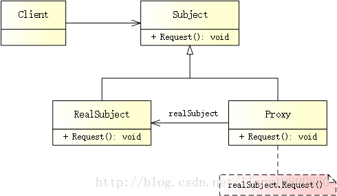

# 代理模式

## 简述
> 代理模式（Proxy Pattern）为其他对象提供了一种代理，以控制对这个对象的访问。在某些情况下，一个对象不适合或者不能直接引用另一个对象，而代理对象可以在客户端和目标对象之间起到中介的作用。


## 模式结构
UML 结构图：



- Subject（抽象主题）：声明了 RealSubject 与 Proxy 的共同接口，定义了某个/些功能。
- RealSubject（真实主题）：通常执行具体的业务逻辑，Proxy 控制对它的访问。
- Proxy（代理）：持有一个 RealSubject 引用（指针），可以在需要时将请求转发给 RealSubject，以此起到代理的作用。
- Client（客户端）：通过 Proxy 间接地与 RealSubject 进行交互。
注意： Proxy 和 RealSubject 都实现了 Subject 的接口，这允许 Client 可以像处理 RealSubject 一样处理 Proxy。

## 优缺点
优点：

- 代理模式能将代理对象与真正被调用的对象分离，在一定程度上降低了系统的耦合度。
- 在客户端和目标对象之间，代理起到一个中介作用，这样可以保护目标对象。在对目标对象调用之前，代理对象也可以进行其他操作。

缺点：

- 这种模式引入了另一个抽象层，这有时可能是一个问题。如果真实主题被某些客户端直接访问，并且其中一些客户端可能访问代理类，这可能会导致不同的行为。
- 由于在客户端和真实主题之间增加了代理对象，因此有些类型的代理模式可能会造成请求的处理速度变慢。
- 实现代理模式需要额外的工作，有些代理模式的实现非常复杂。

## 适用场景
根据目的和实现方式的不同，代理模式可分为很多种，常见的有：

- 远程代理（Remote Proxy） 
为一个位于不同地址空间的对象提供一个本地代理，对代理的方法调用会导致对远程对象的方法调用。ATM 就是一个例子，ATM 可能会持有（存在于远程服务器中的）银行信息的一个代理对象。

- 虚拟代理（Virtual Proxy） 
使用虚拟代理，代理可以作为一个（资源消耗较大的）对象的代表。虚拟代理经常延迟对象的创建，直到需要为止。在创建对象之前（及创建对象过程中），虚拟代理也可以作为对象的代理；之后，代理将请求直接委托给 RealSubject。

- 保护代理（Protection Proxy） 
根据访问权限，可以使用保护代理来控制对资源的访问。例如，有一个员工对象，保护代理可以允许普通员工调用对象的某些方法，管理员调用其他方法。

- 缓冲代理（Cache Proxy） 
为某一个目标操作的结果提供临时的存储空间，以便多个客户端可以共享这些结果。

- 智能引用代理（Smart Reference Proxy） 
当一个对象被引用时，提供一些额外的操作（例如：将对象被调用的次数记录下来）。

## 案例分析
中国移动 - 代理商


在现实生活中，代理无处不在 - 代购、手机代理商、火车票代售点。。。

记得刚上大学时，去学校报道，基本上都要买手机（好怀念 Nokia）、办卡、充值。学校附近的各种代理点很多：“办卡、办卡，动感地带月租只要 18 啦”、“充值、充值，充 100 送 50”。。。各种吆喝声此起彼伏 O(∩_∩)O哈哈~

这里，代理模式可以理解为：移动公司把充值的职责托付给代理点，代理点代替移动公司充值，客户直接与代理点打交道，而非移动公司。

代码实现
创建抽象主题

定义一个电信运行商 ITelco，并为其提供一个接口 Recharge()，用于充值：
```cpp
// subject.h
#ifndef SUBJECT_H
#define SUBJECT_H

// 电信运营商
class ITelco
{
public:
    virtual ~ITelco(){}
    virtual void Recharge(int money) = 0;  // 充值
};

#endif // SUBJECT_H
```
创建真实主题

我一直用的是移动，所以就选它吧！它继承自抽象主题类，提供了业务方法的具体实现：
```cpp
// real_subject.h
#ifndef REAL_SUBJECT_H
#define REAL_SUBJECT_H

#include "subject.h"
#include <iostream>

// 中国移动
class CMCC : public ITelco
{
public:
    void Recharge(int money) override {
        std::cout << "Recharge " << money;
    }
};

#endif // REAL_SUBJECT_H
```
创建代理

由于刚开学，代理点生意十分火爆，小顾客顾不上 - 低于 50 不充：
```cpp
// proxy.h
#ifndef PROXY_H
#define PROXY_H

#include "subject.h"
#include "real_subject.h"
#include <iostream>

// 代理点
class Proxy : public ITelco
{
public:
    Proxy() : m_pCMCC(NULL) {}
    ~Proxy() { delete m_pCMCC; }

    // 低于 50 不充
    void Recharge(int money) override {
        if (money >= 50) {
            if (m_pCMCC == NULL)
                m_pCMCC = new CMCC();
            m_pCMCC->Recharge(money);
        } else {
            std::cout << "Sorry, too little money" << std::endl;
        }
    }

private:
    CMCC *m_pCMCC;
};

#endif // PROXY_H
```
注意： 代理类也是抽象主题类的子类，调用时可以在原有业务方法的基础上附加一些新的方法，来对功能进行扩充或约束。

创建客户端

现在，开始排队办业务啦：
```cpp
// main.cpp
#include "proxy.h"

#ifndef SAFE_DELETE
#define SAFE_DELETE(p) { if(p){delete(p); (p)=NULL;} }
#endif

int main()
{
    Proxy* proxy = new Proxy();
    proxy->Recharge(20);
    proxy->Recharge(100);

    SAFE_DELETE(proxy);
    
    getchar();
    
    return 0;
}
```
输出如下：
```
Sorry, too little money 
Recharge 100
```
一开始我们拿了 20 块钱去充值，代理点不给充。。。一怒之下，狂甩 100！
