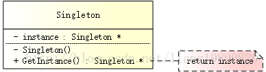

## 简述

单例模式（Singleton Pattern）是设计模式中最简单的形式之一，其目的是使得类的一个对象成为系统中的唯一实例。

这种模式涉及到一个单一的类，该类负责创建自己的对象，同时确保只有单个对象被创建。这个类提供了一种访问其唯一对象的方式，可以直接访问，不需要实例化该类的对象。




## 要点

单例模式的要点有三个：

- 单例类有且仅有一个实例
- 单例类必须自行创建自己的唯一实例
- 单例类必须给所有其他对象提供这一实例


从具体实现角度来说，可分为以下三点：

- 提供一个 private 构造函数（防止外部调用而构造类的实例）
- 提供一个该类的 static private 对象
- 提供一个 static public 函数，用于创建或获取其本身的静态私有对象（例如：GetInstance()）


除此之外，还有一些关键点（需要多加注意，很容易忽视）：

- 线程安全（双检锁 - DCL，即：double-checked locking）
- 资源释放


## 不正确方式

### 局部静态变量

```cpp
// singleton.h
#ifndef SINGLETON_H
#define SINGLETON_H

// 非真正意义上的单例
class Singleton
{
public:
    static Singleton& GetInstance()
    {
        static Singleton instance;
        return instance;
    }

private:
    Singleton() {}
};

#endif // SINGLETON_H

```

但是，这并非真正意义上的单例。当使用如下方式访问单例时：

```cpp
Singleton single = Singleton::GetInstance();
```

这会出现了一个类拷贝问题，从而违背了单例的特性。产生这个问题原因在于：编译器会生成一个默认的拷贝构造函数，来支持类的拷贝。

为了避免这个问题，有两种解决方式：

- 
  将 GetInstance() 函数的返回类型修改为指针，而非引用。

- 显式地声明类的拷贝构造函数，并重载赋值运算符。

对于第一种方式，只需要修改 GetInstance() 的返回类型即可：

```cpp
// singleton.h
#ifndef SINGLETON_H
#define SINGLETON_H

// 单例
class Singleton
{
public:
    // 修改返回类型为指针类型
    static Singleton* GetInstance()
    {
        static Singleton instance;
        return &instance;
    }

private:
    Singleton() {}
};

#endif // SINGLETON_H

```

既然编译器会生成一个默认的拷贝构造函数，那么，为什么不让编译器不这么干呢？这就产生了第二种方式：

```cpp
// singleton.h
#ifndef SINGLETON_H
#define SINGLETON_H

#include <iostream>

using namespace std;

// 单例
class Singleton
{
public:
    static Singleton& GetInstance()
    {
        static Singleton instance;
        return instance;
    }

    void doSomething() {
        cout << "Do something" << endl;
    }

private:
    Singleton() {}  // 构造函数（被保护）
    Singleton(Singleton const &);  // 无需实现
    Singleton& operator = (const Singleton &);  // 无需实现
};

#endif // SINGLETON_H

```

这样以来，既可以保证只存在一个实例，又不用考虑内存回收的问题。

```cpp
Singleton::GetInstance().doSomething();  // OK
Singleton single = Singleton::GetInstance();  // Error 不能编译通过
```


## 单例模式标准写法

```cpp
// singleton.h
#ifndef SINGLETON_H
#define SINGLETON_H

// 单例 - 懒汉式/饿汉式公用
class Singleton
{
public:
    static Singleton* GetInstance();

private:
    Singleton() {}  // 构造函数（被保护）

private:
    static Singleton *m_pSingleton;  // 指向单例对象的指针
};

#endif // SINGLETON_H
```

### 饿汉式

特点：

- 非 Lazy 初始化
- 多线程安全

优点：没有加锁，执行效率会提高。 
缺点：类加载时就初始化，浪费内存。


```cpp
// singleton.cpp
#include "singleton.h"

// 单例 - 饿汉式
Singleton *Singleton::m_pSingleton = new Singleton();

Singleton *Singleton::GetInstance()
{
    return m_pSingleton;

}
```

### 懒汉式

特点：
- Lazy 初始化
- 非多线程安全

优点：第一次调用才初始化，避免内存浪费。 
缺点：必须加锁（在“线程安全”部分分享如何加锁）才能保证单例，但加锁会影响效率。


```cpp
// singleton.cpp
#include "singleton.h"

// 单例 - 懒汉式
Singleton *Singleton::m_pSingleton = NULL;

Singleton *Singleton::GetInstance()
{
    if (m_pSingleton == NULL)
        m_pSingleton = new Singleton();

    return m_pSingleton;
}
```

### 懒汉式-线程安全

在懒汉式下，如果使用多线程，会出现线程安全隐患。为了解决这个问题，可以引入双检锁 - DCL 机制。

```cpp
// singleton.h
#ifndef SINGLETON_H
#define SINGLETON_H

#include <iostream>
#include <mutex>
using namespace std;

// 单例 - 懒汉式/饿汉式公用
class Singleton
{
public:
    static Singleton* GetInstance();

private:
    Singleton() {}  // 构造函数（被保护）

private:
    static Singleton *m_pSingleton;  // 指向单例对象的指针
    static mutex m_mutex;  // 锁
};

#endif // SINGLETON_H
```


```cpp
// singleton.cpp
#include "singleton.h"

// 单例 - 懒汉式（双检锁 DCL 机制）
Singleton *Singleton::m_pSingleton = NULL;
mutex Singleton::m_mutex;

Singleton *Singleton::GetInstance()
{
    if (m_pSingleton == NULL) {
        std::lock_guard<std::mutex> lock(m_mutex);  // 自解锁
        if (m_pSingleton == NULL) {
            m_pSingleton = new Singleton();
        }
    }
    return m_pSingleton;
}
```


这样，就可以保证线程安全了，但是，会带来较小的性能影响。


## 资源释放

有内存申请，就要有对应的释放，可以采用下述两种方式：


- 主动释放（手动调用接口来释放资源）
- 自动释放（由程序自己释放）


要手动释放资源，添加一个 static 接口，编写需要释放资源的代码：


```cpp
// 单例 - 主动释放
static void DestoryInstance()
{
    if (m_pSingleton != NULL) {
        delete m_pSingleton;
        m_pSingleton = NULL;
    }
}
```
然后在需要释放的时候，手动调用该接口：
```cpp
Singleton::GetInstance()->DestoryInstance();1
```
方式虽然简单，但很多时候，容易忘记调用 DestoryInstance()。这时，可以采用更方便的方式：
```cpp
// singleton.h
#ifndef SINGLETON_H
#define SINGLETON_H

#include <iostream>

using namespace std;

// 单例 - 自动释放
class Singleton
{
public:
    static Singleton* GetInstance();

private:
    Singleton() {}  // 构造函数（被保护）

private:
    static Singleton *m_pSingleton;  // 指向单例对象的指针

    // GC 机制
    class GC
    {
    public:
        ~GC(){
            // 可以在这里销毁所有的资源，例如：db 连接、文件句柄等
            if (m_pSingleton != NULL) {
                cout << "Here destroy the m_pSingleton..." << endl;
                delete m_pSingleton;
                m_pSingleton = NULL;
            }
        }
        static GC gc;  // 用于释放单例
    };
};

#endif // SINGLETON_H
```

只需要声明 Singleton::GC 即可：


```cpp
// main.cpp
#include "singleton.h"

Singleton::GC Singleton::GC::gc; // 重要

int main()
{
    Singleton *pSingleton1 = Singleton::GetInstance();
    Singleton *pSingleton2 = Singleton::GetInstance();

    cout << (pSingleton1 == pSingleton2) << endl;
    
    return 0;
}
```

在程序运行结束时，系统会调用 Singleton 的静态成员 GC 的析构函数，该析构函数会进行资源的释放。这种方式的最大优点就是在“不知不觉”中进行，所以，对我们来说，尤为省心。


