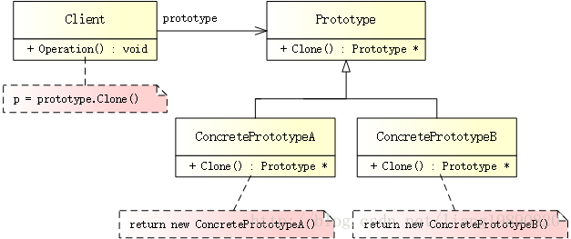

# 原型模式

## 简述

> 原型模式（Prototype Pattern）是一种创建型设计模式，允许一个对象再创建另外一个可定制的对象，而无需知道任何创建的细节。


## 模式结构
UML 结构图：



- Prototype（抽象原型）：定义了克隆自身的接口。
- ConcretePrototype（具体原型）：被复制的对象，需要实现 Prototype 定义的接口。

优缺点
优点：

- 如果创建新的对象比较复杂，可以利用原型模式简化对象的创建过程，同时也能够提高效率。
- 简化对象的创建，无需理会创建过程。
- 可以在程序运行时（对象属性发生了变化）获得一份内容相同的实例，他们之间不会相互干扰。

缺点：

- 在实现深拷贝时可能需要比较复杂的代码
- 需要为每一个类配备一个克隆方法，而且该克隆方法需要对类的功能进行通盘考虑，这对全新的类来说不是很难，但对已有的类进行改造时，不一定是件容易的事，必须修改其源代码，违背了“开闭原则”。

适用场景
- 如果创建新对象成本较大，可以利用已有的对象进行复制来获得。
- 如果系统要保存对象的状态，而对象的状态变化很小，或者对象本身占内存不大的时候，也可以使用原型模式配合备忘录模式来应用。相反，如果对象的状态变化很大，或者对象占用的内存很大，那么采用状态模式会比原型模式更好。
- 需要避免使用分层次的工厂类来创建分层次的对象，并且类的实例对象只有一个或很少的几个组合状态，通过复制原型对象得到新实例可能比使用构造函数创建一个新实例更加方便。

## 案例分析
你挑着担 我牵着马 
迎来日出 送走晚霞 
…… 
敢问路在何方 路在脚下 
敢问路在何方 路在脚下

一首《敢问路在何方》，触动了无数人的心弦。当年只要前奏一响，小伙伴们就再也把持不住了。。。《西游记》作为四大名著之一，可谓是家喻户晓，神一样的存在。从小到大，更是百看不厌。

记得孙悟空在打黄风怪、收七狮的时候，会拔一根猴毛，幻化为成千上万个孙悟空（猴哥、猴哥，你真了不得）。。。原型模式亦是如此，同样提供了自我复制功能。


注： 《西游记》中记载：孙悟空本是花果山上一块仙石所生，天地生成，无父母，无名无姓，拜菩提祖师处，得名孙悟空。

PS： 示例中的抽象原型为猴子（Monkey）类，而非仙石类，千万不要一脸懵逼！

代码实现
创建抽象原型

定义一个猴子类 Monkey，并提供一个 Clone() 接口，用于自我复制。
```cpp
// prototype.h
#ifndef PROTOTYPE_H
#define PROTOTYPE_H

// 猴子
class Monkey
{
public:
    Monkey(){}
    virtual ~Monkey(){}
    virtual Monkey* Clone() = 0;  // 克隆
    virtual void Play() = 0;  // 玩耍
};

#endif // PROTOTYPE_H
```
创建具体原型

美猴王腾空出世：
```cpp
// concrete_prototype.h
#ifndef CONCRETE_PROTOTYPE_H
#define CONCRETE_PROTOTYPE_H

#include "prototype.h"
#include <iostream>
#include <string>

using namespace std;

// 孙悟空
class SunWuKong : public Monkey
{
public:
    SunWuKong(string name){ m_strName = name; }
    ~SunWuKong(){}

    // 拷贝构造函数
    SunWuKong(const SunWuKong &other) {
        m_strName = other.m_strName;
    }
    Monkey* Clone() {
        // 调用拷贝构造函数
        return new SunWuKong(*this);
    }
    void Play() {
        cout << m_strName << " play Golden-Hoop-Stick" << endl;
    }

private:
    string m_strName;
};

#endif // CONCRETE_PROTOTYPE_H
```
同样是猴子，别的猴子玩的是 LOL，而孙悟空玩的是金箍棒（Golden-Hoop-Stick），谁要他是齐天大圣呢！

创建客户端

拔一根猴毛，吹出猴万个：
```cpp
// main.cpp
#include "concrete_prototype.h"

#ifndef SAFE_DELETE
#define SAFE_DELETE(p) { if(p){delete(p); (p)=NULL;} }
#endif

int main()
{
    // 孙悟空
    Monkey *pSWK = new SunWuKong("Qi Tian Da Sheng");

    // 克隆猴子猴孙
    Monkey *pSWK1 = pSWK->Clone();
    Monkey *pSWK2 = pSWK1->Clone();
    
    pSWK1->Play();
    pSWK2->Play();
    
    SAFE_DELETE(pSWK1);
    SAFE_DELETE(pSWK2);
    SAFE_DELETE(pSWK);
    
    getchar();
    
    return 0;
}
```

输出如下：

Qi Tian Da Sheng play Golden-Hoop-Stick 
Qi Tian Da Sheng play Golden-Hoop-Stick

除了孙悟空以外，我们还可以创建六耳猕猴，其实力和孙悟空一般无二，两者大战，闹的天翻地覆。。。真是快哉！
