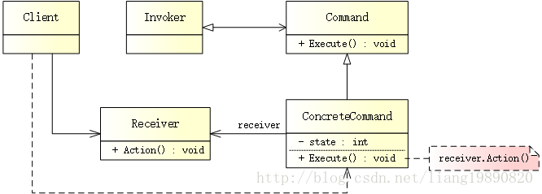
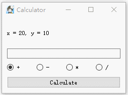

# 命令模式

## 简述
> 命令模式（Command Pattern）是一种数据驱动的设计模式，它属于行为型模式。请求以命令的形式包裹在对象中，并传递给调用对象。调用对象寻找可以处理该命令的合适对象，并把该命令传给相应的对象，该对象执行命令。

### 背景
在应用程序中，经常需要对相同的数据执行多个操作。可以这样简单的理解：用户有一些数据，并且界面提供了很多选项，他可以对该数据进行其中的某些操作。例如，图片处理器：可以选择旋转/翻转/反转照片。另外，一旦有不满意的处理，很有可能需要撤消。这就是基本的业务逻辑，必须要在实现过程中考虑清楚。

大多情况下，最容易想到的是：当动作触发后，调用接收者对应的方法。但是这存在不少问题：

- 要写很多条件代码，必须为每个操作编写非常类似的代码。
- 如果有更多的命令，就会发现需要经常更改现有代码。
显然，这种无法抵御变化的紧耦合设计不太合适。在这种情况下，如何将“行为请求者”与“行为实现者”解耦？将一组行为抽象为对象，实现二者之间的松耦合。这就是命令模式。

## 模式结构
UML 结构图：



- Command：定义命令的接口，声明执行的方法。
- ConcreteCommand：命令接口实现对象，是“虚”的实现；通常会持有接收者，并调用接收者的功能来完成命令要执行的操作。
- Receiver：接收者，真正执行命令的对象。任何类都可能成为一个接收者，只要它能够实现命令要求实现的相应功能。
- Invoker：要求命令对象执行请求，通常会持有命令对象，可以持有很多的命令对象。这个是客户端真正触发命令并要求命令执行相应操作的地方，也就是说相当于使用命令对象的入口。
- Client：创建具体命令对象，并设置其接收者（注意： 这并非常规意义上的客户端，而是在组装命令对象和接收者。或许，把这个 Client 称为装配者会更好理解，因为真正使用命令的客户端是从 Invoker 来触发执行）。

## 代码实现
简易计算器

简易计算器主要专注于理解命令模式，而不是实现一个真正的计算器。因此，将对一组固定的数据（x = 20, y = 10）进行基本操作（加减乘除）。假设将创建一个这样的应用程序：



从 Command 类开始，这是一个抽象类，将被用作执行命令的接口。其他的 ConcreteCommand 类派生自它，提供了具体的命令（加减乘除）。
```cpp
//command.h

#ifndef COMMAND_H
#define COMMAND_H

class IReciever;

// 提供执行命令的接口
class Command
{
public:
    Command(IReciever *reciever);
    virtual int execute() = 0;  // 执行命令
protected:
    IReciever *m_pReciever;
};

// 加法
class AddCommand : public Command
{
public:
    AddCommand(IReciever *reciever);
    int execute();
};

// 减法
class SubtractCommand : public Command
{
public:
    SubtractCommand(IReciever *reciever);
    int execute();
};

// 乘法
class MultiplyCommand : public Command
{
public:
    MultiplyCommand(IReciever *reciever);
    int execute();
};

// 除法
class DivideCommand : public Command
{
public:
    DivideCommand(IReciever *reciever);
    int execute();
};

#endif // COMMAND_H
```
```cpp
//command.cpp

#include "command.h"
#include "reciever.h"

Command::Command(IReciever *reciever)
    : m_pReciever(reciever)
{

}

// 加法
AddCommand::AddCommand(IReciever *reciever)
    : Command(reciever)
{

}

int AddCommand::execute()
{
    m_pReciever->setAction(TYPES::ACTION::ADD);
    return m_pReciever->getResult();
}

// 减法
SubtractCommand::SubtractCommand(IReciever *reciever)
    : Command(reciever)
{

}

int SubtractCommand::execute()
{
    m_pReciever->setAction(TYPES::ACTION::SUBTRACT);
    return m_pReciever->getResult();
}

// 乘法
MultiplyCommand::MultiplyCommand(IReciever *reciever)
    : Command(reciever)
{

}

int MultiplyCommand::execute()
{
    m_pReciever->setAction(TYPES::ACTION::MULTIPLY);
    return m_pReciever->getResult();
}

// 除法
DivideCommand::DivideCommand(IReciever *reciever)
    : Command(reciever)
{

}

int DivideCommand::execute()
{
    m_pReciever->setAction(TYPES::ACTION::DIVIDE);
    return m_pReciever->getResult();
}
```


准备好命令的层次结构后，现在来编写真正的程序逻辑 - 需要一个类来进行计算 - Reciever，提供了一个接口表示接收者的主要功能，其中 Calculator 类为 Reciever 的具体实现：
```cpp
//reciever.h

#ifndef RECIEVER_H
#define RECIEVER_H

namespace TYPES
{
    enum ACTION
    {
        ADD,  // 加法
        SUBTRACT,  // 减法
        MULTIPLY,  // 乘法
        DIVIDE   // 除法
    };
}

// 命令接收者
class IReciever
{
public:
    virtual void setAction(TYPES::ACTION action) = 0;  // 设置具体命令
    virtual int getResult() = 0;  // 获取命令结果
};

// 命令接收者具体实现
class Calculator : public IReciever
{
public:
    Calculator(int x, int y);
    void setAction(TYPES::ACTION action);
    int getResult();

private:
    int m_nX;
    int m_nY;
    TYPES::ACTION m_currentAction;
};

#endif // RECIEVER_H
```

```cpp
//reciever.cpp

#include "reciever.h"

Calculator::Calculator(int x, int y)
    : m_nX(x),
      m_nY(y)
{

}

void Calculator::setAction(TYPES::ACTION action)
{
    m_currentAction = action;
}

int Calculator::getResult()
{
    int nResult;
    switch (m_currentAction) {
    case TYPES::ACTION::ADD :
        nResult = m_nX + m_nY;
        break;
    case TYPES::ACTION::SUBTRACT :
        nResult = m_nX - m_nY;
        break;
    case TYPES::ACTION::MULTIPLY :
        nResult = m_nX * m_nY;
        break;
    case TYPES::ACTION::DIVIDE :
        nResult = m_nX / m_nY;
        break;
    default:
        break;
    }

    return nResult;
}
```

需要一个类，让用户选择要执行的命令 - Client（也就是 UI）。最后，还需要写一个 Invoker，在示例中依然是用户界面。

```cpp
//widget.h

#ifndef WIDGET_H
#define WIDGET_H

#include <QWidget>
#include "reciever.h"
#include "command.h"

class QLineEdit;

class Widget : public QWidget
{
    Q_OBJECT

public:
    Widget(QWidget *parent = 0);
    ~Widget();

private Q_SLOTS:
    void onButtonClicked(int id);  // 设置当前命令
    void onCalculate();  // 计算结果

private:
    QLineEdit *m_pResultEdit;

    Calculator calculator;
    Command *command;  // 用于调用命令
    AddCommand addCmd;  // 加法
    SubtractCommand subCmd;  // 减法
    MultiplyCommand mulCmd;  // 乘法
    DivideCommand divCmd;  // 除法
};

#endif // WIDGET_H
```

```cpp
//widget.cpp

#include "widget.h"
#include <QButtonGroup>
#include <QRadioButton>
#include <QPushButton>
#include <QLabel>
#include <QLineEdit>
#include <QHBoxLayout>

Widget::Widget(QWidget *parent)
    : QWidget(parent),
      calculator(20, 10),
      command(nullptr),
      addCmd(&calculator),
      subCmd(&calculator),
      mulCmd(&calculator),
      divCmd(&calculator)
{
    setWindowTitle("Calculator");
    setWindowIcon(QIcon(":/logo.png"));

    // 按钮组
    QButtonGroup *pButtonGroup = new QButtonGroup(this);
    QRadioButton *pAddButton = new QRadioButton("+", this);
    QRadioButton *pSubButton = new QRadioButton("-", this);
    QRadioButton *pMulButton = new QRadioButton("*", this);
    QRadioButton *pDivButton = new QRadioButton("/", this);
    QLabel *pLabel = new QLabel("x = 20, y = 10", this);
    m_pResultEdit = new QLineEdit(this);
    QPushButton *pCalButton = new QPushButton("Calculate", this);
    
    m_pResultEdit->setReadOnly(true);
    
    pButtonGroup->addButton(pAddButton, 0);
    pButtonGroup->addButton(pSubButton, 1);
    pButtonGroup->addButton(pMulButton, 2);
    pButtonGroup->addButton(pDivButton, 3);
    pButtonGroup->setExclusive(true);  // 互斥
    
    QHBoxLayout *pHLayout = new QHBoxLayout();
    pHLayout->addWidget(pAddButton);
    pHLayout->addWidget(pSubButton);
    pHLayout->addWidget(pMulButton);
    pHLayout->addWidget(pDivButton);
    pHLayout->setContentsMargins(0, 0, 0, 0);
    pHLayout->setSpacing(10);
    
    QVBoxLayout *pLayout = new QVBoxLayout(this);
    pLayout->addWidget(pLabel);
    pLayout->addWidget(m_pResultEdit);
    pLayout->addLayout(pHLayout);
    pLayout->addWidget(pCalButton);
    pLayout->setSpacing(10);
    pLayout->setContentsMargins(10, 10, 10, 10);
    
    // 连接信号槽
    connect(pButtonGroup, static_cast<void (QButtonGroup::*)(int)>(&QButtonGroup::buttonClicked), this, &Widget::onButtonClicked);
    connect(pCalButton, &QPushButton::clicked, this, &Widget::onCalculate);
    
    // 默认选择加法
    pButtonGroup->button(0)->click();
}

Widget::~Widget()
{

}

// 设置当前命令
void Widget::onButtonClicked(int id)
{
    if (id == 0) {
        command = &addCmd;
    } else if (id == 1) {
        command = &subCmd;
    } else if (id == 2) {
        command = &mulCmd;
    } else if (id == 3) {
        command = &divCmd;
    }
}

// 计算结果
void Widget::onCalculate()
{
    int nResult = command->execute();
    m_pResultEdit->setText(QString::number(nResult));
}
```
单选按钮所触发的事件只是改变要使用的命令对象，并且当用户选择计算时，将使用适当的命令对象来获取结果。

## 命令队列
根据命令模式，实现一个命令队列，形成一个命令链。

以打车为例，又是滴滴（~O(∩_∩)O~），用户发起一个“打车”命令，司机接单，到达终点时，用户再次发起一个“付款”命令，司机收款。

和上述示例类似， Command 是一个抽象类，将被用作执行命令的接口。其他的 ConcreteCommand 类派生自它，提供了具体的命令（打车/付款）。
```cpp
//command.h

#ifndef COMMAND_H
#define COMMAND_H

class Reciever;

// 提供执行命令的接口
class Command
{
public:
    Command(Reciever *reciever);
    virtual void execute() = 0;  // 执行命令
protected:
    Reciever *m_pReciever;
};

// 打车
class TakeCommand : public Command
{
public:
    TakeCommand(Reciever *reciever);
    void execute();
};

// 付款
class PayCommand : public Command
{
public:
    PayCommand(Reciever *reciever);
    void execute();
};

#endif // COMMAND_H
```

```cpp
//command.cpp

#include "command.h"
#include "reciever.h"
#include <iostream>

Command::Command(Reciever *reciever)
    : m_pReciever(reciever)
{

}

// 打车
TakeCommand::TakeCommand(Reciever *reciever)
    : Command(reciever)
{

}

void TakeCommand::execute()
{
    std::cout << "Take command..." << std::endl;
    m_pReciever->takeOrder();
}

// 付款
PayCommand::PayCommand(Reciever *reciever)
    : Command(reciever)
{

}

void PayCommand::execute()
{
    std::cout << "Pay command..." << std::endl;
    m_pReciever->receipt();
}
```


有了 Command，就需要有对应的 Invoker 来持有命令，然后进行触发。
```cpp
//invoker.h

#ifndef INVOKER_H
#define INVOKER_H

#include <list>
#include "command.h"

// 命令的持有者
class Invoker
{
public:
    Invoker();
    void addCmd(Command *cmd);  // 添加命令
    void deleteCmd(Command *cmd);  // 删除命令
    void notify();  // 执行命令

private:
    std::list<Command *> m_cmds;  // 命令队列
};

#endif // INVOKER_H
```


```cpp
//invoker.cpp

#include "invoker.h"

Invoker::Invoker()
{

}

void Invoker::addCmd(Command *cmd)
{
    m_cmds.push_back(cmd);
}

void Invoker::deleteCmd(Command *cmd)
{
    m_cmds.remove(cmd);
}

void Invoker::notify()
{
    std::list<Command *>::iterator it = m_cmds.begin();
    while (it != m_cmds.end()) {
        (*it)->execute();
        ++it;
    }
}
```

最后是 Reciever，也就是司机，用于执行命令（接单/收款）。
```cpp
//reciever.h

#ifndef RECIEVER_H
#define RECIEVER_H

// 司机
class Reciever
{
public:
    void takeOrder();  // 接单
    void receipt();  // 收款
};

#endif // RECIEVER_H
```


```cpp
//reciever.cpp

#include "reciever.h"
#include <iostream>

// 接单
void Reciever::takeOrder()
{
    std::cout << "Take order..." << std::endl;
}

// 收款
void Reciever::receipt()
{
    std::cout << "Receipt..." << std::endl;
}
```


使用起来比较简单：
```cpp
#include "invoker.h"
#include "reciever.h"
#include "command.h"

int main()
{
    Reciever *rev = new Reciever();
    Command *cmd1 = new TakeCommand(rev);
    PayCommand *cmd2 = new PayCommand(rev);
    Invoker inv;

    inv.addCmd(cmd1);
    inv.addCmd(cmd2);
    inv.notify();
    
    delete cmd1;
    delete cmd2;
    delete rev;
    
    return 0;
}
```


输出如下：
```
Take command… 
Take order… 
Pay command… 
Receipt…
```
开始，我们创建了两个命令（打车 & 付款），通过 Invoker 的 addCmd() 将他们加入至命令队列，然后 notify() 通知执行命令，这样，就形成了一个命令链。

兴趣点
要降低发送者和接收者之间的耦合度，命令模式是一种非常好的方式。在实现命令模式时，要记住，最重要的事情是：命令只是发送者和接收者之间的链接。它应该只告诉接收者发送者期望的是什么，而不应该以任何方式改变发送者和接收者的逻辑。