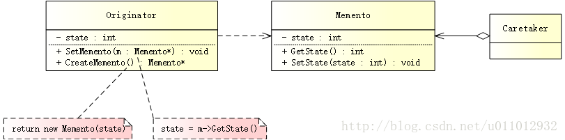

# 备忘录模式

## 简述
备忘录模式（Memento Pattern）在不破坏封装的前提下，捕获一个对象的内部状态，并在该对象之外保存这个状态，这样可以在以后将对象恢复到原先保存的状态。


## 模式结构
UML 结构图：



- Originator（发起人）：负责创建一个 Memento，以记录当前时刻自身的内部状态，并可以使用 Memento 恢复内部状态。Originator 可以根据需要决定 Memento 储存自己的哪些内部状态。
- Memento（备忘录）：负责存储 Originator 对象的内部状态，并可以防止 Originator 以外的其他对象访问备忘录。
- Caretaker（管理者）：负责管理 Memento，但不能对 Memento 的内容进行访问或者操作。

## 优缺点

优点：

- 提供了一种状态恢复机制，使用户能够方便地回到某个历史的状态。
- 实现了信息的封装，使得用户不需要关心状态的保存细节。

缺点：

- 如果 Originator 对象很大，那么 Memento 对象也会很大，这势必会占用较大的存储空间，而且每保存一次都需要消耗一定的系统资源。

## 适用场景

保存一个对象在某一个时刻的全部（或部分）状态，这样在以后需要时便能够恢复到先前的状态，实现撤销操作。
防止外界对象破坏一个对象历史状态的封装性，避免将对象历史状态的实现细节暴露给外界对象。

## 案例分析
月光宝盒 - 让时光倒流


很多人说年少时看《大话西游》，看着看着就笑了；长大之后再看，看着看着就哭了。无论是笑了还是哭了，心中总有很多疑惑无法解开。

《大话西游》依托于“月光宝盒”，构建了几个平行时空中发生的爱情故事。其中，有一个经典桥段：

至尊宝在盘丝洞找到盘丝大仙留下的月光宝盒，此时牛魔王带白晶晶来到盘丝洞。白晶晶以为春三十娘和二当家生下的孩子是她和至尊宝所生，愤而自刎。至尊宝为了救白晶晶，使用月光宝盒使时光倒流，几次后产生故障，竟将其带回五百年前，这时紫霞仙子向他走来 …

和“月光宝盒”一样，备忘录模式也提供了时光倒流的机制，将一个对象某个时刻的状态进行备份，当用户后悔（需要返回之前的状态）时，可以把备份调用出来！

## 代码实现
创建备忘录

穿越至某一时刻，这个时刻指具体的日期时间，用 DateTime 表示，并为其提供相应的 setter 和 getter 方法：
```cpp
// memento.h
#ifndef MEMENTO_H
#define MEMENTO_H

#include <iostream>
#include <string>

// 日期时间
class DateTime
{
public:
    DateTime(std::string dt)
        : m_dateTime(dt) {}

    void SetDateTime(std::string dt) {
        m_dateTime = dt;
    }
    
    std::string GetDateTime() {
        return m_dateTime;
    }

private:
    std::string m_dateTime;
};

#endif // MEMENTO_H
```

创建发起人

Life 用于创建 DateTime，以记录当前的日期时间，并可以使用 DateTime 进行恢复：
```cpp
// originator.h
#ifndef ORIGINATOR_H
#define ORIGINATOR_H

#include "memento.h"
#include <iostream>
#include <string>

// 一生
class Life
{
public:
    void SetDateTime(std::string dt) {
        std::cout << "Set date time to " << dt << std::endl;
        m_dateTime = dt;
    }

    // 仅用于打印
    std::string GetDateTime() {
        return m_dateTime;
    }
    
    // 恢复日期时间
    void SetMemento(DateTime *dt) {
        m_dateTime = dt->GetDateTime();
    }
    
    // 创建日期时间
    DateTime *CreateMemento() {
        return new DateTime(m_dateTime);
    }

private:
    std::string m_dateTime;
};

#endif // ORIGINATOR_H
```


创建管理者

这是时光倒流的关键，通过 PandoraBox，至尊宝才可以弥补遗憾：
```cpp
// care_taker.h
#ifndef CARE_TAKER_H
#define CARE_TAKER_H

#include "originator.h"
#include <iostream>
#include <vector>

// 月光宝盒
class PandoraBox
{
public:
    PandoraBox(Life *life)
        : m_pLife(life) {}

    ~PandoraBox() {
        for (int i = 0; i < m_history.size(); i++) {
            delete m_history.at(i);
        }
        m_history.clear();
    }
    
    // 保存备份
    void Save() {
        std::cout << "Save ..." << std::endl;;
        m_history.push_back(m_pLife->CreateMemento());
    }
    
    // 穿越至上一时刻
    void Undo() {
        std::cout << "Undo ..." << std::endl;;
        m_pLife->SetMemento(m_history.back());
        m_history.pop_back();
    }

private:
    Life *m_pLife;
    std::vector<DateTime *> m_history;
};

#endif // CARE_TAKER_H
```

创建客户端

想启动“月光宝盒”，体验一把穿越的感觉？大声喊出那句烂熟于心的“般bō若rě波罗蜜”：
```cpp
// main.cpp
#include "originator.h"
#include "care_taker.h"

#ifndef SAFE_DELETE
#define SAFE_DELETE(p) { if(p){delete(p); (p)=NULL;} }
#endif

int main()
{
    Life *life = new Life();
    PandoraBox *box = new PandoraBox(life);

    // 设置并保存一个历史时间
    life->SetDateTime("2000/10/01 00:00:00");
    box->Save();
    
    // 设置并保存一个历史时间
    life->SetDateTime("2010/10/01 00:00:00");
    box->Save();
    
    // 设置一个历史时间
    life->SetDateTime("2018/10/01 00:00:00");
    
    // 穿越
    box->Undo();
    std::cout << "Actual date time is " << life->GetDateTime() << std::endl;
    
    // 再次穿越
    box->Undo();
    std::cout << "Actual date time is " << life->GetDateTime() << std::endl;
    
    SAFE_DELETE(life);
    SAFE_DELETE(box);
    
    getchar();
    
    return 0;
}
```

输出如下：
```
Set date time to 2000/10/01 00:00:00 
Save … 
Set date time to 2010/10/01 00:00:00 
Save … 
Set date time to 2018/10/01 00:00:00 
Undo … 
Actual date time is 2010/10/01 00:00:00 
Undo … 
Actual date time is 2000/10/01 00:00:00
```

