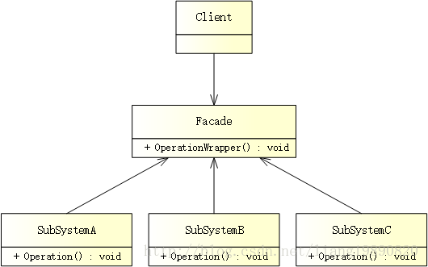

# 外观模式

## 简述
> 外观模式（Facade Pattern）又称为门面模式，属于结构型模式。Façade 为子系统中的一组接口提供了一个统一的高层接口，该接口使得子系统更加容易使用。


## 模式结构
UML 结构图：



- Facade（外观）：模式的核心，被 Client 调用，知晓相关子系统的功能和责任。在正常情况下，它将所有从 Client 发来的请求委派到相应的子系统去，让子系统处理。
- SubSystem（子系统）：可以同时有一个或者多个子系统，子系统可以是一个单独的类或类的集合。每个子系统都可以被 Client 直接调用，或者被 Facade 调用，它处理由 Facade 传过来的请求。子系统并不知道 Facade 的存在，对于子系统而言，Facade 仅仅是另外一个 Client 而已。

## 优缺点
优点：

- 对 Client 屏蔽子系统组件，减少了 Client 处理的对象数目，并使得子系统使用起来更加容易。通过引入外观模式，Client 的代码将变得很简单，与之关联的对象也很少。
- 实现了子系统与 Client 之间的松耦合关系，这使得子系统的组件变化不会影响到调用它的 Client，只需要调整 Facade 即可。
- 降低了大型软件系统中的编译依赖性，并简化了系统在不同平台之间的移植过程，因为编译一个子系统一般不需要编译所有其他的子系统。一个子系统的修改对其他子系统没有任何影响，而且子系统内部变化也不会影响到外观对象。
- 只是提供了一个访问子系统的统一入口，并不影响用户直接使用子系统类。

缺点：

- 不能很好地限制 Client 使用子系统类，如果对 Client 访问子系统类做太多的限制，则会减少可变性和灵活性。
- 在不引入抽象外观类的情况下，增加新的子系统可能需要修改 Facade 或 Client 的源代码，违背了“开闭原则”。

## 适用场景
- 当要为一个复杂子系统提供一个简单接口时。该接口可以满足大多数用户的需求，而且用户也可以越过外观类直接访问子系统。
- Client 与多个子系统之间存在很大的依赖性。引入外观类将子系统与 Client 以及其他子系统解耦，可以提高子系统的独立性和可移植性。
- 在层次化结构中，可以使用外观模式定义系统中每一层的入口。层与层之间不直接产生联系，而通过外观类建立联系，降低层之间的耦合度。

## 案例分析
京东 - 多快好省 只为品质生活

以前，人们购物需要去超市、百货商店、农贸集市等。网络流行之后，越来越多的人喜欢网购，足不出户便可以淘到很多好东西。

比起传统模式，网购有很多好处：

方便、快捷，节省时间和费用。
网络信息透明，容易了解卖家信誉度。
网上物品应有尽有，可以非常方便地货比三家。
除此之外，很多网上商城还不断搞各种活动，双 11、双 12、国庆、元旦、春节，各种花样应有尽有。。。

像京东、淘宝、亚马逊这些电商平台，客户挑选好喜欢的宝贝，然后进行结算。在随后的过程中，我们并不清楚这些网站背后的情况，所关注的只不过是，下完订单后，将会在一段时间后收货。其实，在幕后，任务被分发给不同的子系统（订单团队、供应商、快递员）去完成，为了方便，可以进行订单跟踪：

> 下订单 –> 订单验证 –> 打包 –> 出货 –> 派送 –> 交付

PS： 说到速度，就不得不夸奖京东了，物流很给力，早上下单，下午送达。。。

## 代码实现
创建子系统

子系统包含 3 个，订单团队（确认付款、联系供应商）、供应商（确认库存、包装、联系快递）、快递员（分配人员、派送包裹）。
```cpp
// sub_system.h
#ifndef SUB_SYSTEM_H
#define SUB_SYSTEM_H

#include <iostream>
#include <string>
#include <windows.h>

const std::string c_stateToStrCourier[] = { "收到", "验证可达性", "分配人员", "派送包裹", "获取交货确认", "完成" };
const std::string c_stateToStrVendor[] = { "收到", "确认库存", "从仓库得到物品", "包装", "联系快递员", "完成" };
const std::string c_stateToStrOrderTeam[] = { "收到", "确认付款", "联系供应商", "完成" };
const int c_nMsec = 300;  // 休眠时间（毫秒） - Sleep(c_nMsec) 处可以替换为一些有用的代码

// 订单团队
class OrderTeam
{
public:
    void submitRequest() {
        m_nState = 0;
    }

    // 检测状态
    bool checkStatus() {
        std::cout << "订单团队 - 当前状态：" << c_stateToStrOrderTeam[m_nState] << std::endl;
    
        Sleep(c_nMsec);
        m_nState++;
    
        return (m_nState == Complete);
    }

private:
    enum States {
        Received,  // 收到
        VerifyPayment,  // 确认付款
        ContactVendor,  // 联系供应商
        Complete  // 完成
    };
    int m_nState;
};

// 供应商
class Vendor
{
public:
    void submitRequest() {
        m_nState = 0;
    }

    // 检测状态
    bool checkStatus() {
        std::cout << "供应商 - 当前状态：" << c_stateToStrVendor[m_nState] << std::endl;
    
        Sleep(c_nMsec);
        m_nState++;
    
        return (m_nState == Complete);
    }

private:
    enum States {
        Received,  // 收到
        VerifyInventory,  // 确认库存
        GetItemFromWareHouse,  // 从仓库得到物品
        PackItem,  // 包装
        ContactCourier,  // 联系快递员
        Complete  // 完成
    };
    int m_nState;
};

// 快递员
class Courier
{
public:
    // 将请求转发给快递员
    void submitRequest() {
        m_nState = 0;
    }

    // 检测状态
    bool checkStatus() {
        std::cout << "快递员 - 当前状态：" << c_stateToStrCourier[m_nState] << std::endl;
    
        Sleep(c_nMsec);
        m_nState++;
    
        return (m_nState == Complete);
    }

private:
    enum States {
        Received,  // 收到
        VerifyReachbility,  // 验证可达性
        AssignPerson,  // 分配人员
        DispatchPackage,  // 派送包裹
        GetDeliveryConfirmation,  // 获取交货确认
        Complete  // 完成
    };
    int m_nState;
};

#endif // SUB_SYSTEM_H
```

创建外观

用于网上购物的外观，提供了暴露给客户的接口，虽然可以跟踪订单，但仍然隐藏背后的复杂过程。
```cpp
// facade.h
#ifndef FACADE_H
#define FACADE_H

#include "sub_system.h"

// 网购外观
class OnlineShoppingFacade
{
public:
    OnlineShoppingFacade() {
        m_nCount = 0;
    }

    // 返回跟踪次数
    int followupNum() {
        return m_nCount;
    }
    
    // 提交订单
    void submitRequest() {
        m_nState = 0;
    }
    
    // 跟踪订单
    bool checkStatus(){
        // 收到订单请求
        switch (m_nState) {
        case Received:
            m_nState++;
            // 将请求转发给订单团队
            m_order.submitRequest();
            std::cout << "********** 提交给订单团队，跟踪次数：" << m_nCount << " **********" << std::endl;
            break;
        case SubmittedToOrderTeam:
            // 如果订单团队完成验证，则向供应商发出请求
            if (m_order.checkStatus()) {
                m_nState++;
                m_vendor.submitRequest();
                std::cout << "********** 提交给供应商，跟踪次数：" << m_nCount << " **********" << std::endl;
            }
            break;
        case SubmittedToVendor:
            // 如果供应商已将包裹打包，将其转发给快递员
            if (m_vendor.checkStatus()) {
                m_nState++;
                m_courier.submitRequest();
                std::cout << "********** 提交给快递员，跟踪次数：" << m_nCount << " **********" << std::endl;
            }
            break;
        case SubmittedToCourier:
            // 如果包裹交付，订单完成
            if (m_courier.checkStatus())
                return true;
        default:
            break;
        }
    
        m_nCount++;
    
        // 订单未完成
        return false;
    }

private:
    enum States {
        Received,  // 收到
        SubmittedToOrderTeam,  // 提交给订单团队
        SubmittedToVendor,  // 提交给供应商
        SubmittedToCourier  // 提交给快递员
    };

    int m_nState;  // 订单状态
    int m_nCount;  // 跟踪次数
    
    OrderTeam m_order;
    Vendor m_vendor;
    Courier m_courier;
};

#endif // FACADE_H
```

创建客户端

最终，客户端实现如下：
```cpp
// main.cpp
#include "facade.h"

int main()
{
    OnlineShoppingFacade facade;

    // 提交订单
    facade.submitRequest();
    
    // 跟踪订单，直到订单完成
    while (!facade.checkStatus());
    
    std::cout << "********** 订单完成，跟踪次数：" << facade.followupNum() << " **********" << std::endl;
    
    getchar();
    
    return 0;
}
```

输出如下：
```
********** 提交给订单团队，跟踪次数：0 ********** 
订单团队 - 当前状态：收到 
订单团队 - 当前状态：确认付款 
订单团队 - 当前状态：联系供应商 
********** 提交给供应商，跟踪次数：3 ********** 
供应商 - 当前状态：收到 
供应商 - 当前状态：确认库存 
供应商 - 当前状态：从仓库得到物品 
供应商 - 当前状态：包装 
供应商 - 当前状态：联系快递员 
********** 提交给快递员，跟踪次数：8 ********** 
快递员 - 当前状态：收到 
快递员 - 当前状态：验证可达性 
快递员 - 当前状态：分配人员 
快递员 - 当前状态：派送包裹 
快递员 - 当前状态：获取交货确认 
********** 订单完成，跟踪次数：13 **********
```