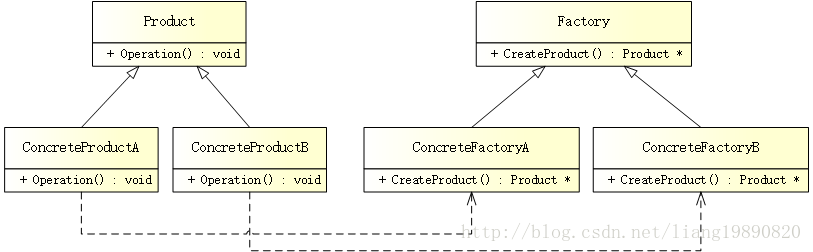

# 工厂方法模式

## 简述
> 工厂方法模式（Factory Method Pattern）是一种常用的对象创建型设计模式，此模式的核心思想是封装类中不变的部分，提取其中个性化善变的部分为独立类，通过依赖注入以达到解耦、复用以及方便后期维护拓展的目的。

 

## 模式结构
UML 结构图：



- Factory（抽象工厂）：是工厂方法模式的核心，与应用程序无关。任何在模式中创建的对象的工厂类必须实现这个接口。
- ConcreteFactory（具体工厂）：实现抽象工厂接口的具体工厂类，包含与应用程序密切相关的逻辑，并且被应用程序调用以创建产品对象。
- Product（抽象产品）：所创建对象的基类，也就是具体产品的共同父类或共同拥有的接口。
- ConcreteProduct（具体产品）：实现了抽象产品角色所定义的接口。某具体产品有专门的具体工厂创建，它们之间往往一一对应。

## 优缺点
优点:

- 克服了简单工厂模式违背开放-封闭原则的缺点，又保留了封装对象创建过程的优点，降低客户端和工厂的耦合性。所以说，“工厂方法模式”是“简单工厂模式”的进一步抽象和推广。

缺点:
- 每增加一个产品，相应的也要增加一个子工厂，加大了额外的开发量。

适用场景
- 对于某个产品，调用者清楚地知道应该使用哪个具体工厂服务，实例化该具体工厂，生产出具体的产品来。
- 只是需要一种产品，而不想知道也不需要知道究竟是哪个工厂生产的，即最终选用哪个具体工厂的决定权在生产者一方，它们根据当前系统的情况来实例化一个具体的工厂返回给使用者，而这个决策过程对于使用者来说是透明的。

案例分析

工厂模式基本和简单工厂模式差不多，简单工厂模式 - 在产品子类添加时，需要添加一个判断分支，这违背了开放-封闭原则。因此，工厂模式就是为了解决这个问题而产生的。

所以，对于 简单工厂模式 一节中的 BBA 来说，要分别由对应的工厂来生产。

## 代码实现
创建抽象产品

在我们的示例中，需要有一个汽车产品 - ICar：
```cpp
// product.h
#ifndef PRODUCT_H
#define PRODUCT_H

#include <string>

using namespace std;

// 汽车接口
class ICar
{
public:
    virtual string Name() = 0;  // 汽车名称
};

#endif // PRODUCT_H
```
创建具体产品

有了抽象产品，继续为其创建一些具体的产品：
```cpp
// concrete_product.h
#ifndef CONCRETE_PRODUCT_H
#define CONCRETE_PRODUCT_H

#include "product.h"

// 奔驰汽车
class BenzCar : public ICar
{
public:
    string Name() {
        return "Benz Car";
    }
};

// 宝马汽车
class BmwCar : public ICar
{
public:
    string Name() {
        return "Bmw Car";
    }
};

// 奥迪汽车
class AudiCar : public ICar
{
public:
    string Name() {
        return "Audi Car";
    }
};

#endif // CONCRETE_PRODUCT_H
```
创建工厂

产品有了，当然要有相应的工厂来生产，但在这之前，需要一个抽象工厂：
```cpp
// factory.h
#ifndef FACTORY_H
#define FACTORY_H

#include "product.h"

// 工厂接口
class AFactory
{
public:
    virtual ICar* CreateCar() = 0;  // 生产汽车
};

#endif // FACTORY_H
```
创建具体工厂

为每个制造商创建对应的的工厂：
```cpp
// concrete_factory.h
#ifndef CONCRETE_FACTORY_H
#define CONCRETE_FACTORY_H

#include "factory.h"
#include "concrete_product.h"

// 奔驰工厂
class BenzFactory : public AFactory
{
public:
    ICar* CreateCar() {
        return new BenzCar();
    }
};

// 宝马工厂
class BmwFactory : public AFactory
{
public:
    ICar* CreateCar() {
        return new BmwCar();
    }
};

// 奥迪工厂
class AudiFactory : public AFactory
{
public:
    ICar* CreateCar() {
        return new AudiCar();
    }
};

#endif // CONCRETE_FACTORY_H
```
这样以来，每个工厂只负责生产自己的产品。

创建客户端

当一切准备就绪，就可以实现客户端了：
```cpp
// main.cpp
#include "concrete_factory.h"
#include "product.h"
#include <iostream>

#ifndef SAFE_DELETE
#define SAFE_DELETE(p) { if(p){delete(p); (p)=NULL;} }
#endif

int main()
{
    // 奔驰
    AFactory *pFactory = new BenzFactory();
    ICar *pCar = pFactory->CreateCar();
    cout << "Benz factory: " << pCar->Name() << endl;

    SAFE_DELETE(pCar);
    SAFE_DELETE(pFactory);
    
    // 宝马
    pFactory = new BmwFactory();
    pCar = pFactory->CreateCar();
    cout << "Bmw factory: " << pCar->Name() << endl;
    
    SAFE_DELETE(pCar);
    SAFE_DELETE(pFactory);
    
    // 奥迪
    pFactory = new AudiFactory();
    pCar = pFactory->CreateCar();
    cout << "Audi factory: " << pCar->Name() << endl;
    
    SAFE_DELETE(pCar);
    SAFE_DELETE(pFactory);
    
    getchar();
    
    return 0;
}
```

输出如下：

Benz factory: Benz Car 
Bmw factory: Bmw Car 
Audi factory: Audi Car
