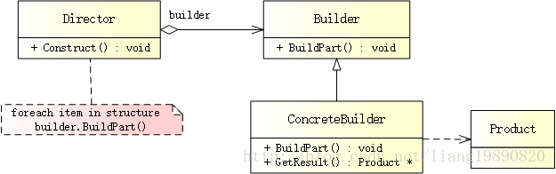

# 建造者模式

## 简述
> 建造者模式（Builder Pattern），旨在将一个复杂对象的构建与它的表示分离，使得同样的构建过程可以创建不同的表示。


## 模式结构
UML 结构图：



- Builder（抽象建造者）：为创建一个产品对象的各个部件指定抽象接口。
- ConcreteBuilder（具体建造者）：实现 Builder 的接口以构造和装配该产品的各个部件，定义并明确它所创建的表示，并提供一个检索产品的接口。
- Director（指挥者）：构造一个使用 Builder 接口的对象。
- Product（产品）：表示被构造的复杂对象。ConcreteBuilder 创建该产品的内部表示并定义它的装配过程，包含定义组成部件的类，包括将这些部件装配成最终产品的接口。

## 优缺点
优点：
- 建造者独立，易于扩展
- 便于控制细节风险

缺点：
- 产品必须有共同点，范围有限制
- 如果内部变化复杂，将会有很多的建造类

适用场景
- 需要生成的对象具有复杂的内部结构
- 需要生成的对象内部属性本身相互依赖

## 案例分析
Lenovo For Those Who Do - 联想

联想旗下有众多系列的电脑，例如：ThinkPad 和 Yoga。。。在科技创新的大潮下，产品层出不穷。电脑虽多，但结构基本一致，都是由 CPU、主板、内存、显卡等组成。如果为每台电脑都单独设计一个组装流程，管理的成本太高。这时，建造者模式就出现了，为所有系列指定一个统一的组装流程，所有的电脑都按照这个流程来组装。

### 代码实现
#### 创建产品

我们需要一个 Computer 类，它可以通过组装零件来创建。
```cpp
// product.h
#ifndef PRODUCT_H
#define PRODUCT_H

#include <iostream>

using namespace std;

// 电脑
class Computer
{
public:
    void SetmCpu(string cpu) { m_strCpu = cpu;}
    void SetmMainboard(string mainboard) { m_strMainboard = mainboard; }
    void SetmRam(string ram) { m_strRam = ram; }
    void SetVideoCard(string videoCard) { m_strVideoCard = videoCard; }

    string GetCPU() { return m_strCpu; }
    string GetMainboard()  { return m_strMainboard; }
    string GetRam() { return m_strRam; }
    string GetVideoCard() { return m_strVideoCard; }

private:
    string m_strCpu;  // CPU
    string m_strMainboard;  // 主板
    string m_strRam;  // 内存
    string m_strVideoCard;  // 显卡
};

#endif // PRODUCT_H
```

#### 创建抽象建造者

产品类准备好以后，就可以创建 Builder 了，Builder 提供的功能用于创建电脑的各个部件。
```cpp
// builder.h
#ifndef BUILDER_H
#define BUILDER_H

#include "product.h"

// 建造者接口，组装流程
class IBuilder
{
public:
    virtual void BuildCpu() = 0;  // 创建 CPU
    virtual void BuildMainboard() = 0;  // 创建主板
    virtual void BuildRam() = 0;  // 创建内存
    virtual void BuildVideoCard() = 0;  // 创建显卡
    virtual Computer* GetResult() = 0;  // 获取建造后的产品
};

#endif // BUILDER_H
```
#### 创建具体建造者

有了 Builder 接口，接下来的事情就是让 ConcreteBuilder 对象到位。在这些建造者中，我们可以指定每台电脑要使用的部件信息。
```cpp
// concrete_bulider.h
#ifndef CONCRETE_BULIDER_H
#define CONCRETE_BULIDER_H

#include "builder.h"

// ThinkPad 系列
class ThinkPadBuilder : public IBuilder
{
public:
    ThinkPadBuilder() { m_pComputer = new Computer(); }
    void BuildCpu() { m_pComputer->SetmCpu("i5-6200U"); }
    void BuildMainboard() { m_pComputer->SetmMainboard("Intel DH57DD"); }
    void BuildRam() { m_pComputer->SetmRam("DDR4"); }
    void BuildVideoCard()  { m_pComputer->SetVideoCard("NVIDIA Geforce 920MX"); }
    Computer* GetResult() { return m_pComputer; }

private:
    Computer *m_pComputer;
};

// Yoga 系列
class YogaBuilder : public IBuilder
{
public:
    YogaBuilder() { m_pComputer = new Computer(); }
    void BuildCpu() { m_pComputer->SetmCpu("i7-7500U"); }
    void BuildMainboard() { m_pComputer->SetmMainboard("Intel DP55KG"); }
    void BuildRam() { m_pComputer->SetmRam("DDR5"); }
    void BuildVideoCard()  { m_pComputer->SetVideoCard("NVIDIA GeForce 940MX"); }
    Computer* GetResult() { return m_pComputer; }

private:
    Computer *m_pComputer;
};

#endif // CONCRETE_BULIDER_H
```
#### 创建指挥者

最后，我们来创建一个 Director 类，让 Create 方法接受一个 IBuilder，然后在内部调用相应的组装函数。
```cpp
// director.h
#ifndef DIRECTOR_H
#define DIRECTOR_H

#include "builder.h"

// 指挥者
class Direcror
{
public:
    void Create(IBuilder *builder) {
        builder->BuildCpu();
        builder->BuildMainboard();
        builder->BuildRam();
        builder->BuildVideoCard();
    }
};

#endif // DIRECTOR_H
```
#### 创建客户端

现在，一起来看看客户端代码，可以看到创建任何产品都非常干净。
```cpp
// main.cpp
#include "concrete_bulider.h"
#include "director.h"
#include <string>

#ifndef SAFE_DELETE
#define SAFE_DELETE(p) { if(p){delete(p); (p)=NULL;} }
#endif

int main()
{
    Direcror *pDirecror = new Direcror();
    ThinkPadBuilder *pTPBuilder = new ThinkPadBuilder();
    YogaBuilder *pYogaBuilder = new YogaBuilder();

    // 组装 ThinkPad、Yoga
    pDirecror->Create(pTPBuilder);
    pDirecror->Create(pYogaBuilder);
    
    // 获取组装后的电脑
    Computer *pThinkPadComputer = pTPBuilder->GetResult();
    Computer *pYogaComputer = pYogaBuilder->GetResult();
    
    // 测试输出
    cout << "-----ThinkPad-----" << endl;
    cout << "CPU: " << pThinkPadComputer->GetCPU() << endl;
    cout << "Mainboard: " << pThinkPadComputer->GetMainboard() << endl;
    cout << "Ram: " << pThinkPadComputer->GetRam() << endl;
    cout << "VideoCard: " << pThinkPadComputer->GetVideoCard() << endl;
    
    cout << "-----Yoga-----" << endl;
    cout << "CPU: " << pYogaComputer->GetCPU() << endl;
    cout << "Mainboard: " << pYogaComputer->GetMainboard() << endl;
    cout << "Ram: " << pYogaComputer->GetRam() << endl;
    cout << "VideoCard: " << pYogaComputer->GetVideoCard() << endl;
    
    SAFE_DELETE(pThinkPadComputer);
    SAFE_DELETE(pYogaComputer);
    SAFE_DELETE(pTPBuilder);
    SAFE_DELETE(pYogaBuilder);
    SAFE_DELETE(pDirecror);
    
    getchar();
    
    return 0;
}
```

输出如下：

> —–ThinkPad—– 
CPU: i5-6200U 
Mainboard: Intel DH57DD 
Ram: DDR4 
VideoCard: NVIDIA Geforce 920MX 
—–Yoga—– 
CPU: i7-7500U 
Mainboard: Intel DP55KG 
Ram: DDR5 
VideoCard: NVIDIA GeForce 940MX

如果需要创建更多的产品，只需要一个 ConcreteBuilder 即可，并且所有的代码都基本相同，客户端还可以使用此模式轻松地创建复杂的产品。


