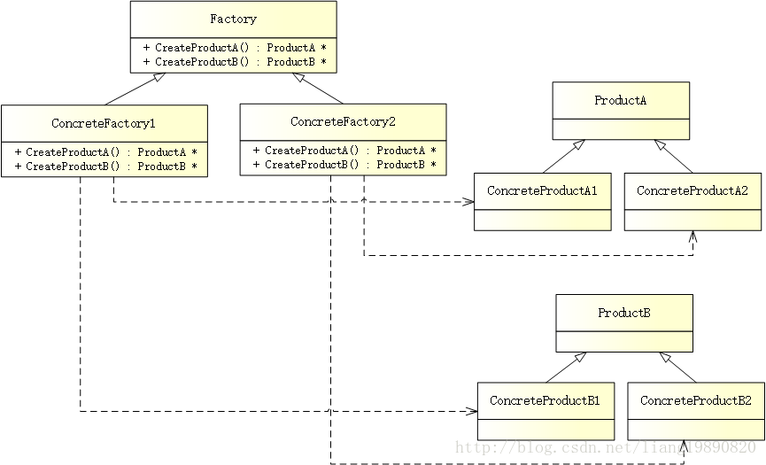

# 抽象工厂模式

## 简述
> 抽象工厂模式（Abstract Factory Pattern）是所有形态的工厂模式中最为抽象和最具一般性的一种形态。抽象工厂模式是指当有多个抽象角色时，使用的一种工厂模式。抽象工厂模式可以向客户端提供一个接口，使客户端在不必指定产品的具体的情况下，创建多个产品族中的产品对象。

**工厂模式**：主要是将创建对象的具体过程给封装屏蔽起来，达到提高灵活性的目的。

## 模式结构
UML 结构图：



- Factory（抽象工厂）：声明一个用于创建抽象产品的接口
- ConcreteFactory（具体工厂）：用于创建具体的产品
- Product（抽象产品）：声明一个产品对象类型的接口
- ConcreteProduct（具体产品）：由具体工厂创建的具体产品

## 优缺点
优点：

- 封装了产品的创建，使得不需要知道具体是哪种产品，只需要知道是哪个工厂即可。
- 可以支持不同类型的产品，使得模式灵活性更强。
- 可以非常方便的使用一族中的不同类型的产品。

缺点：

- 结构过于臃肿，如果产品类型较多或产品族较多，会非常难于管理。
- 每次如果添加一组产品，那么所有的工厂类都必须添加一个方法，这样违背了开放-封闭原则。所以一般适用于产品组合产品族变化不大的情况。

适用场景

- 在不必指定产品的具体的情况下，创建多个产品族中的产品对象。

## 案例分析

工厂方法模式 要求产品必须为同一类型，也就是说，BBA 只能生产汽车，要生产其他产品（例如：自行车）是不行的，这显然限制了产品的扩展。为了解决这个问题，抽象工厂模式出现了 - 将产品归类分组，然后将好几组产品构成一族。每个工厂负责生产一族产品，而工厂中的每个方法负责生产一种类型的产品。

这样，客户端只需要创建具体工厂的实例，然后调用工厂对象的工厂方法就可以得到所需要的产品对象。

## 代码实现
#### 创建抽象产品

在我们的示例中，需要有两个产品 - 汽车和自行车：
```cpp
// product.h
#ifndef PRODUCT_H
#define PRODUCT_H

#include <string>

using namespace std;

// 汽车接口
class ICar
{
public:
    virtual string Name() = 0;  // 汽车名称
};

// 自行车接口
class IBike
{
public:
    virtual string Name() = 0;  // 自行车名称
};

#endif // PRODUCT_H
```

#### 创建具体产品

有了抽象产品，继续创建一些具体的产品：
```cpp
// concrete_product.h
#ifndef CONCRETE_PRODUCT_H
#define CONCRETE_PRODUCT_H

#include "product.h"

/********** 汽车 **********/
// 奔驰
class BenzCar : public ICar
{
public:
    string Name() {
        return "Benz Car";
    }
};

// 宝马
class BmwCar : public ICar
{
public:
    string Name() {
        return "Bmw Car";
    }
};

// 奥迪
class AudiCar : public ICar
{
public:
    std::string Name() {
        return "Audi Car";
    }
};

/********** 自行车 **********/
// 奔驰
class BenzBike : public IBike
{
public:
    string Name() {
        return "Benz Bike";
    }
};

// 宝马
class BmwBike : public IBike
{
public:
    string Name() {
        return "Bmw Bike";
    }
};

// 奥迪
class AudiBike : public IBike
{
public:
    string Name() {
        return "Audi Bike";
    }
};

#endif // CONCRETE_PRODUCT_H
```
这样，为汽车和自行车都准备好了所有的具体类。

## 创建抽象工厂

产品有了，当然要有相应的制造商与其相关联，所以呢，要有具体的工厂。但在这之前，需要一个抽象工厂：

```cpp
// factory.h
#ifndef FACTORY_H
#define FACTORY_H

#include "product.h"

// 抽象工厂
class AFactory
{
public:
    enum FACTORY_TYPE {
        BENZ_FACTORY,  // 奔驰工厂
        BMW_FACTORY,  // 宝马工厂
        AUDI_FACTORY  // 奥迪工厂
    };

    virtual ICar* CreateCar() = 0;  // 生产汽车
    virtual IBike* CreateBike() = 0;    // 生产自行车
    static AFactory* CreateFactory(FACTORY_TYPE factory);  // 创建工厂
};

#endif // FACTORY_H
```

```cpp
// factory.cpp
#include "factory.h"
#include "concrete_factory.h"

// 创建工厂
AFactory* AFactory::CreateFactory(FACTORY_TYPE factory)
{
    AFactory *pFactory = NULL;
    switch (factory) {
    case FACTORY_TYPE::BENZ_FACTORY:  // 奔驰工厂
        pFactory = new BenzFactory();
        break;
    case FACTORY_TYPE::BMW_FACTORY:  // 宝马工厂
        pFactory = new BmwFactory();
        break;
    case FACTORY_TYPE::AUDI_FACTORY:  // 奥迪工厂
        pFactory = new AudiFactory();
        break;
    default:
        break;
    }
    return pFactory;
}
```


#### 创建具体工厂

为每个制造商创建具体的工厂：
```cpp
// concrete_factory.h
#ifndef CONCRETE_FACTORY_H
#define CONCRETE_FACTORY_H

#include "factory.h"
#include "concrete_product.h"

// 奔驰工厂
class BenzFactory : public AFactory
{
public:
    ICar* CreateCar() {
        return new BenzCar();
    }

    IBike* CreateBike() {
        return new BenzBike();
    }
};

// 宝马工厂
class BmwFactory : public AFactory
{
public:
    ICar* CreateCar() {
        return new BmwCar();
    }

    IBike* CreateBike() {
        return new BmwBike();
    }
};

// 奥迪工厂
class AudiFactory : public AFactory
{
public:
    ICar* CreateCar() {
        return new AudiCar();
    }

    IBike* CreateBike() {
        return new AudiBike();
    }
};

#endif // CONCRETE_FACTORY_H
```

这样以来，具体的产品就与其制造商关联起来了。

## 创建客户端

当一切准备就绪，就可以实现客户端了，利用相关产品的这种层次结构来创建产品。 
```cpp
// main.cpp
#include "factory.h"
#include "product.h"
#include <iostream>

using namespace std;

#ifndef SAFE_DELETE
#define SAFE_DELETE(p) { if(p){delete(p); (p)=NULL;} }
#endif

int main()
{
    // 奔驰
    AFactory *pFactory = AFactory::CreateFactory(AFactory::FACTORY_TYPE::BENZ_FACTORY);
    ICar *pCar = pFactory->CreateCar();
    IBike *pBike = pFactory->CreateBike();

    cout << "Benz factory - Car: " << pCar->Name() << endl;
    cout << "Benz factory - Bike: " << pBike->Name() << endl;
    
    SAFE_DELETE(pCar);
    SAFE_DELETE(pBike);
    SAFE_DELETE(pFactory);
    
    // 宝马
    pFactory = AFactory::CreateFactory(AFactory::FACTORY_TYPE::BMW_FACTORY);
    pCar = pFactory->CreateCar();
    pBike = pFactory->CreateBike();
    cout << "Bmw factory - Car: " << pCar->Name() << endl;
    cout << "Bmw factory - Bike: " << pBike->Name() << endl;
    
    SAFE_DELETE(pCar);
    SAFE_DELETE(pBike);
    SAFE_DELETE(pFactory);
    
    // 奥迪
    pFactory = AFactory::CreateFactory(AFactory::FACTORY_TYPE::AUDI_FACTORY);
    pCar = pFactory->CreateCar();
    pBike = pFactory->CreateBike();
    cout << "Audi factory - Car: " << pCar->Name() << endl;
    cout << "Audi factory - Bike: " << pBike->Name() << endl;
    
    SAFE_DELETE(pCar);
    SAFE_DELETE(pBike);
    SAFE_DELETE(pFactory);
    
    getchar();
    
    return 0;
}
```
输出如下：

Benz factory - Car: Benz Car 
Benz factory - Bike: Benz Bike 
Bmw factory - Car: Bmw Car 
Bmw factory - Bike: Bmw Bike 
Audi factory - Car: Audi Car 
Audi factory - Bike: Audi Bike

到这里，抽象工厂模式的基本框架已经有了，我们仅输出了具体产品的名字，其实还可以包含更多的信息，请根据需要自行扩展。
