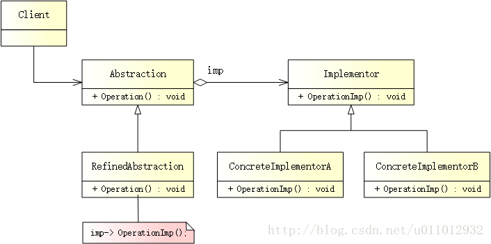

## 桥接模式
> 桥接模式（Bridge Pattern）是将抽象部分与它的实现部分分离，使它们都可以独立地变化。

## 模式结构
UML 结构图：



- Abstraction（抽象类）：用于定义抽象类的接口，并且维护一个指向 Implementor 实现类的指针。它与 Implementor 之间具有关联关系。
- RefinedAbstraction（扩充抽象类）：扩充由 Abstraction 定义的接口，在 RefinedAbstraction 中可以调用在 Implementor 中定义的业务方法。
- Implementor（实现类接口）：定义实现类的接口，这个接口不一定要与 Abstraction 的接口完全一致，事实上这两个接口可以完全不同。
- ConcreteImplementor（具体实现类）：实现了 Implementor 定义的接口，在不同的 ConcreteImplementor 中提供基本操作的不同实现。在程序运行时，ConcreteImplementor 对象将替换其父类对象，提供给 Abstraction 具体的业务操作方法。

## 优缺点
优点：

- 分离抽象和实现部分。桥接模式使用“对象间的关联关系”解耦了抽象和实现之间固有的绑定关系，使得抽象和实现可以沿着各自的维度来变化。所谓抽象和实现沿着各自维度的变化，也就是说抽象和实现不再在同一个继承层次结构中，而是“子类化”它们，使它们各自都具有自己的子类，以便任何组合子类，从而获得多维度组合对象。
- 在很多情况下，桥接模式可以取代多层继承方案，多层继承方案违背了“单一职责原则”，复用性较差，且类的个数非常多，桥接模式是比多层继承方案更好的解决方法，它极大减少了子类的个数。
- 桥接模式提高了系统的可扩展性，在两个变化维度中任意扩展一个维度，都不需要修改原有系统，符合“开闭原则”。

缺点：

- 桥接模式的使用会增加系统的理解与设计难度，由于关联关系建立在抽象层，要求开发者一开始就针对抽象层进行设计与编程。
- 桥接模式要求正确识别出系统中两个独立变化的维度，因此其使用范围具有一定的局限性，如何正确识别两个独立维度也需要一定的经验积累。

适用场景
- 如果一个系统需要在抽象化和具体化之间增加更多的灵活性，避免在两个层次之间建立静态的继承关系，通过桥接模式可以使它们在抽象层建立一个关联关系。
- “抽象部分”和“实现部分”可以以继承的方式独立扩展而互不影响，在程序运行时可以动态将一个抽象化子类的对象和一个实现化子类的对象进行组合，即系统需要对抽象化角色和实现化角色进行动态耦合。
- 一个系统存在多个（≥ 2）独立变化的维度，且这多个维度都需要独立进行扩展。
- 对于那些不希望使用继承或因为多层继承导致系统类的个数急剧增加的系统，桥接模式尤为适用。

## 案例分析

开关和电器


电器是现代生活必不可少的东西，几乎每家每户都有，电视、风扇、电灯。。。无论什么电器，都由开关控制。开关种类众多，有拉链式开关、两位开关、调光开关。。。

不管任何时候，都可以在不触及其它东西的情况下更换设备。例如，可以在不更换开关的情况下换掉灯泡，也可以在不接触灯泡或风扇的情况下更换开关，甚至可以在不接触开关的情况下将灯泡和风扇互换。

这看起来很自然，当然也应该这样！当不同的事物联系到一起时，它们应该在一个可以变更或者替换的系统中，以便不相互影响或者影响尽可能的小，这样才能更方便、更低成本地去管理系统。想象一下，如果要换房间里的一个灯泡，得要求把开关也换了，你会考虑使用这样的系统吗？

代码实现
创建实现类接口

所有电器都有一些共性，可以被打开和关闭：
```cpp
// implementor.h
#ifndef IMPLEMENTOR_H
#define IMPLEMENTOR_H

// 电器
class IElectricalEquipment
{
public:
    virtual ~IElectricalEquipment() {}

    // 打开
    virtual void PowerOn() = 0;
    
    // 关闭
    virtual void PowerOff() = 0;
};

#endif // IMPLEMENTOR_H
```
创建具体实现类

接下来，是真正的电器 - 电灯和风扇，它们实现了 IElectricalEquipment 接口：
```cpp
// concrete_implementor.h
#ifndef CONCRETE_IMPLEMENTOR_H
#define CONCRETE_IMPLEMENTOR_H

#include "implementor.h"
#include <iostream>

// 电灯
class Light : public IElectricalEquipment
{
public:
    // 开灯
    virtual void PowerOn() override {
        std::cout << "Light is on." << std::endl;
    }

    // 关灯
    virtual void PowerOff() override {
        std::cout << "Light is off." << std::endl;
    }
};

// 风扇
class Fan : public IElectricalEquipment
{
public:
    // 打开风扇
    virtual void PowerOn() override {
        std::cout << "Fan is on." << std::endl;
    }

    // 关闭风扇
    virtual void PowerOff() override {
        std::cout << "Fan is off." << std::endl;
    }
};

#endif // CONCRETE_IMPLEMENTOR_H
```
创建抽象类

对于开关来说，它并不知道电灯和风扇的存在，只知道自己可以控制（打开/关闭）某个电器。也就是说，每个 ISwitch 应该持有一个 IElectricalEquipment 对象：
```cpp
// abstraction.h
#ifndef ABSTRACTION_H
#define ABSTRACTION_H

#include "implementor.h"

// 开关
class ISwitch
{
public:
    ISwitch(IElectricalEquipment *ee) { m_pEe = ee;}
    virtual ~ISwitch() {}

    // 打开电器
    virtual void On() = 0;
    
    // 关闭电器
    virtual void Off() = 0;

protected:
    IElectricalEquipment *m_pEe;
};

#endif // ABSTRACTION_H
```
创建扩充抽象类

特定类型的开关很多，比如拉链式开关、两位开关：
```cpp
// refined_abstraction.h
#ifndef REFINED_ABSTRACTION_H
#define REFINED_ABSTRACTION_H

#include "abstraction.h"
#include <iostream>

// 拉链式开关
class PullChainSwitch : public ISwitch
{
public:
    PullChainSwitch(IElectricalEquipment *ee) : ISwitch(ee) {}

    // 用拉链式开关打开电器
    virtual void On() override {
        std::cout << "Switch on the equipment with a pull chain switch." << std::endl;
        m_pEe->PowerOn();
    }
    
    // 用拉链式开关关闭电器
    virtual void Off() override {
        std::cout << "Switch off the equipment with a pull chain switch." << std::endl;
        m_pEe->PowerOff();
    }
};

// 两位开关
class TwoPositionSwitch : public ISwitch
{
public:
    TwoPositionSwitch(IElectricalEquipment *ee) : ISwitch(ee) {}

    // 用两位开关打开电器
    virtual void On() override {
        std::cout << "Switch on the equipment with a two-position switch." << std::endl;
        m_pEe->PowerOn();
    }
    
    // 用两位开关关闭电器
    virtual void Off() override {
        std::cout << "Switch off the equipment with a two-position switch." << std::endl;
        m_pEe->PowerOff();
    }
};

#endif // REFINED_ABSTRACTION_H
```

创建客户端

很好，是时候将开关和电器关联起来了：
```cpp
// main.cpp
#include "refined_abstraction.h"
#include "concrete_implementor.h"

#ifndef SAFE_DELETE
#define SAFE_DELETE(p) { if(p){delete(p); (p)=NULL;} }
#endif

int main()
{
    // 创建电器 - 电灯、风扇
    IElectricalEquipment *light = new Light();
    IElectricalEquipment *fan = new Fan();

    /**
     * 创建开关 - 拉链式开关、两位开关
     * 将拉链式开关和电灯关联起来，将两位开关和风扇关联起来
    **/
    ISwitch *pullChain = new PullChainSwitch(light);
    ISwitch *twoPosition= new TwoPositionSwitch(fan);
    
    // 开灯、关灯
    pullChain->On();
    pullChain->Off();
    
    // 打开风扇、关闭风扇
    twoPosition->On();
    twoPosition->Off();
    
    SAFE_DELETE(twoPosition);
    SAFE_DELETE(pullChain);
    SAFE_DELETE(fan);
    SAFE_DELETE(light);
    
    getchar();
    
    return 0;
}
```

输出如下：
```
Switch on the equipment with a pull chain switch. 
Light is on. 
Switch off the equipment with a pull chain switch. 
Light is off. 
Switch on the equipment with a two-position switch. 
Fan is on. 
Switch off the equipment with a two-position switch. 
Fan is off.
```

