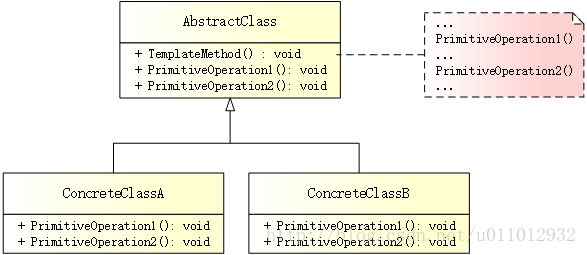

# 模版方法

## 简述
模版方法模式（Template Method Pattern）定义一个操作中算法的骨架，而将一些步骤延迟到子类中。模板方法使得子类可以不改变一个算法的结构即可重定义该算法的某些特定步骤。

模式结构
UML 结构图：



- 抽象类（AbstractClass）：定义抽象的原语操作，具体的子类将重定义它们以实现一个算法的各步骤。主要是实现一个模板方法，定义一个算法的骨架。该模板方法不仅调用原语操作，也调用定义在 AbstractClass 或其他对象中的操作。
- 具体类（ConcreteClass）：实现原语操作以完成算法中与特定子类相关的步骤。

## 优缺点
优点：

- 在父类中形式化地定义一个算法，而由其子类实现细节的处理，在子类实现详细的处理算法时并不会改变算法中步骤的执行次序。
- 模板方法模式是一种代码复用技术，在类库设计中尤为重要，它提取了类库中的公共行为，将公共行为放在父类中，而通过其子类来实现不同的行为，它鼓励我们恰当使用继承来实现代码复用。
- 可实现一种反向控制结构，通过子类覆盖父类的钩子方法来决定某一特定步骤是否需要执行。
- 在模板方法模式中，可以通过子类来覆盖父类的基本方法，不同的子类可以提供基本方法的不同实现，更换和增加新的子类很方便，符合单一职责原则和开闭原则。

缺点：

- 需要为每一个基本方法的不同实现提供一个子类，如果父类中可变的基本方法太多，将会导致类的个数增加，系统更加庞大，设计也更加抽象，此时，可结合桥接模式来进行设计。

## 适用场景
- 对一些复杂的算法进行分割，将算法中固定不变的部分设计为模板方法和父类具体方法，而一些可变的细节由子类实现。
- 各子类中公共的行为应被提取出来并集中到一个公共父类中，以避免代码重复。
- 需要通过子类来决定父类算法中某个步骤是否执行，实现子类对父类的反向控制。

## 案例分析

招聘流程
谈及校招，对学生们而言，最诱人的名字无疑是 BAT，工资高、福利好，而且还能学到很多前沿的技术！当然，巨头公司的 Offer 不是那么容易拿的，不仅要成绩优异，更要技术过人。

无论什么公司，在校招时一般都会采用“宣讲会 -> 接收简历 -> 面试 -> 发放 Offer”这样一套固定流程。其中，各公司宣讲会（宣传企业文化、福利待遇）和接收简历（自带简历）的形式几乎是一样的，不同的是面试和发放 Offer 环节。阿里需要经过一面、二面、三面，并提供30W/年的薪酬；而腾讯则需要一面、二面，并提供25W/年的薪酬。

这里，公司是抽象类，“宣讲会 -> 接收简历 -> 面试 -> 发放 Offer”则是一套固定的模板方法（招聘流程）。具体类由阿里和腾讯表示，不同之处在于面试和发放 Offer 环节，需要它们分别实现。

## 代码实现
创建抽象类

抽象类由 Company 表示，它提供了一套固定的模板方法 Recruit()，用于标准化算法的骨架：
```cpp
// abstract_class.h
#ifndef ABSTRACT_CLASS_H
#define ABSTRACT_CLASS_H

#include <iostream>

// 公司
class Company
{
public:
    virtual ~Company() {}

    // 校园招聘
    void Recruit() {
        std::cout << "---------- Begin ----------" << std::endl;
        CareerTalk();
        ReceiveResume();
        Interview();
        Offer();
        std::cout << "---------- End ----------" << std::endl;
    }
    
    // 宣讲会
    void CareerTalk() {
        std::cout << "Delivery" << std::endl;
    }
    
    // 接收简历
    void ReceiveResume() {
        std::cout << "Receive Resume" << std::endl;
    }
    
    // 面试
    virtual void Interview() = 0;
    
    // 发放 Offer
    virtual void Offer() = 0;
};

#endif // ABSTRACT_CLASS_H
```

注意： 相同的行为 CareerTalk() 和 ReceiveResume() 有默认实现，不同的行为 Interview() 和 Offer() 采用“占位符”方式，需要由具体公司来实现。

创建具体类

具体公司有两个 - Alibaba、Tencent，它们的面试、录用方式不同：
```cpp
// concrete_class.h
#ifndef CONCRETE_CLASS_H
#define CONCRETE_CLASS_H

#include "abstract_class.h"
#include <iostream>

// 阿里
class Alibaba : public Company
{
public:
    virtual void Interview() override {
        std::cout << "First interview -> Second interview -> Third interview" << std::endl;
    }

    virtual void Offer() override {
        std::cout << "30W" << std::endl;
    }
};

// 腾讯
class Tencent : public Company
{
public:
    virtual void Interview() override {
        std::cout << "First interview -> Second interview" << std::endl;
    }

    virtual void Offer() override {
        std::cout << "25W" << std::endl;
    }
};

#endif // CONCRETE_CLASS_H
```

创建客户端

校招开启，Offer 快到碗里来：
```cpp
// main.cpp
#include "concrete_class.h"

#ifndef SAFE_DELETE
#define SAFE_DELETE(p) { if(p){delete(p); (p)=NULL;} }
#endif

int main()
{
    // 阿里校招
    Company *alibaba = new Alibaba();
    alibaba->Recruit();

    // 腾讯校招
    Company *tencent = new Tencent();
    tencent->Recruit();
    
    SAFE_DELETE(tencent);
    SAFE_DELETE(alibaba);
    
    getchar();
    
    return 0;
}
```

输出如下：
```
———- Begin ———- 
Delivery 
Receive Resume 
First interview -> Second interview -> Third interview 
30W 
———- End ———- 
———- Begin ———- 
Delivery 
Receive Resume 
First interview -> Second interview 
25W 
———- End ———-
```
