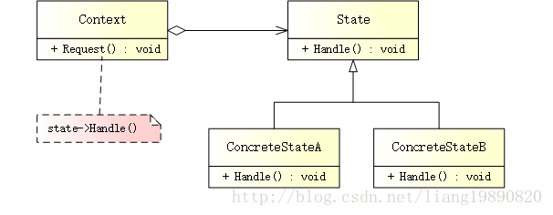
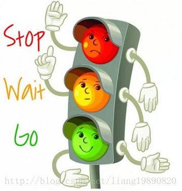

# 状态模式

## 简述
> 状态模式（State Pattern）是行为设计模式之一。当对象根据其内部状态改变其行为时，将使用状态设计模式。

## 模式结构
UML 结构图：



- Context（上下文）：定义一个与 Client 交互的接口。它维护对 ConcreteState 对象的引用，可以用该对象来定义当前状态。
- State（抽象状态）：定义接口，来声明每个 ConcreteState 应该做什么。
- ConcreteState（具体状态）：为 State 中定义的方法提供实现。

## 优缺点
优点：

- 实现多态行为的好处是显而易见的，并且很容易添加状态来支持额外的行为。
- 在状态模式中，对象的行为是其状态中函数的结果，并且在运行时根据状态改变行为，这就消除了对 switch/case 或 if/else 条件逻辑的依赖。
- 可以提高内聚性，因为状态特定的行为被聚合到具体的类中，这些类被放在代码中的一个位置。

缺点：

- 使用状态模式，必然会增加系统中类和对象的个数。
- 由于状态模式的结构与实现较为复杂，一旦使用不当，将会导致程序结构和代码的混乱。
- 若要添加新的状态，则需要修改负责转换的源代码，否则无法转换到新增的状态，而且修改某个状态的行为也要修改源代码。

## 适用场景
- 一个对象的行为取决于它的状态，并且它必须在运行时刻根据状态改变它的行为。
- 一个操作中含有庞大的多分支结构，并且这些分支决定于对象的状态。

## 案例分析
交通信号灯 - 文明出行，从我做起。

红灯停，绿灯行，黄灯亮了等一等。



交叉路口红绿灯，指挥交通显神通； 
绿灯亮了放心走，红灯亮了别抢行； 
黄灯亮了要注意，人人遵守红绿灯。

可以看到，交通信号灯的状态流：红灯 -> 绿灯 -> 黄灯。。。实际上，就是各个状态之间的相互切换，这完全符合状态模式。

代码实现
创建上下文

上下文由 TrafficLights 表示，该类有一个 IState 变量，在构造中被初始化为 RedLight（红灯）：
```cpp
// context.h
#ifndef CONTEXT_H
#define CONTEXT_H

#include "concrete_state.h"

// 交通信号灯
class TrafficLights
{
public:
    TrafficLights() { m_pState = new RedLight(this); }
    void SetState(IState* state) { m_pState = state; }
    void Request() { m_pState->Handle(); }

private:
    IState* m_pState;
};

#endif // CONTEXT_H
```

注意： 在上下文提供的方法中，实际上使用的是 IState 的相应方法。

创建抽象状态

IState 有一个 Handle() 接口，用于改变状态：
```cpp
// state.h
#ifndef STATE_H
#define STATE_H

// 信号灯的状态
class IState
{
public:
    virtual void Handle() = 0;
};

#endif // STATE_H
```

创建具体状态

具体的状态有三个 - 红灯、绿灯、黄灯：
```cpp
// concrete_state.h
#ifndef CONCRETE_STATE_H
#define CONCRETE_STATE_H

#include "state.h"

class TrafficLights;

// 红灯
class RedLight : public IState
{
public:
    RedLight(TrafficLights* context);
    virtual void Handle() override;

private:
    TrafficLights* m_pContext;
};

// 绿灯
class GreenLight : public IState
{
public:
    GreenLight(TrafficLights* context);
    virtual void Handle() override;

private:
    TrafficLights* m_pContext;
};

// 黄灯
class YellowLight : public IState
{
public:
    YellowLight(TrafficLights* context);
    virtual void Handle() override;

private:
    TrafficLights* m_pContext;
};

#endif // CONCRETE_STATE_H
```

它们所提供的方法有对上下文对象的引用，并且能够改变它的状态：
```cpp
// concrete_state.cpp
#include "concrete_state.h"
#include "context.h"
#include <iostream>

// 红灯
RedLight::RedLight(TrafficLights* context) : m_pContext(context) {}

void RedLight::Handle()
{
    std::cout << "Red Light" << std::endl;
    m_pContext->SetState(new GreenLight(m_pContext));
    delete this;
}

// 绿灯
GreenLight::GreenLight(TrafficLights* context) : m_pContext(context) {}

void GreenLight::Handle()
{
    std::cout << "Green Light" << std::endl;
    m_pContext->SetState(new YellowLight(m_pContext));
    delete this;
}

// 黄灯
YellowLight::YellowLight(TrafficLights* context) : m_pContext(context) {}

void YellowLight::Handle()
{
    std::cout << "Yellow Light" << std::endl;
    m_pContext->SetState(new RedLight(m_pContext));
    delete this;
}
```

创建客户端

Ready，go！“交通警察”开始工作啦：
```cpp
// main.cpp
#include "context.h"
#include <iostream>
#include <windows.h>

int main()
{
    TrafficLights tl;

    enum TLState {Red, Green, Yellow};
    
    TLState state = Red;  // 初始状态为红灯
    int i = 0;  // 总次数
    int seconds;  // 秒数
    
    while (true) {
        // 表示一个完整的状态流（红灯->绿灯->黄灯）已经完成
        if (i % 3 == 0)
            std::cout << "**********" << "Session " << ((i+1)/3)+1 << "**********" << std::endl;
    
        // 根据当前状态来设置持续时间，红灯（6秒）、绿灯（4秒）、黄灯（2秒）
        if (state == Red) {
            seconds = 6;
            state = Green;
        } else if (state == Green) {
            seconds = 4;
            state = Yellow;
        } else if (state == Yellow) {
            seconds = 2;
            state = Red;
        }
    
        // 休眠
        Sleep(seconds * 1000);
    
        tl.Request();
        i++;
    }
    
    return 0;
}
```


输出如下：
```
*****Session 1***** 
Red Light 
Green Light 
Yellow Light 
*****Session 2***** 
Red Light 
Green Light 
Yellow Light 
*****Session 3***** 
Red Light 
Green Light 
Yellow Light 
*****Session n***** 

```
