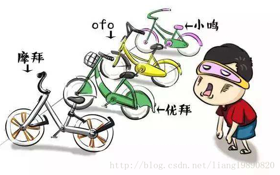

# 策略模式

## 简述

> 策略模式（Strategy Pattern）定义一系列算法，把它们一个个封装起来，并且使它们可以互相替换。Strategy 可以使算法独立于使用算法的客户端。

## 模式结构
UML 结构图：


- Context（环境角色）：持有一个对 Strategy 的引用，最终给客户端调用。
- Strategy（抽象策略）：定义了一个公共接口，让不同的算法以不同的方式来实现。通过这个接口，Context 可以调用不同的算法。
- ConcreteStrategy（具体策略）：实现 Strategy 定义的接口，提供具体算法的实现。

## 优缺点
优点：

- 各自使用封装的算法，可以很容易地引入新的算法来满足相同的接口。
- 由于实现的是同一个接口，所以策略之间可以自由切换。
- Strategy 使客户端能够选择所需的算法，而无需使用 switch/case 或 if/else 语句。
- 算法的细节完全封装在 Strategy 类中，因此，可以在不影响 Context 类的情况下更改算法的实现。

缺点：

- 客户端必须知道所有的策略，了解它们之间的区别，以便适时选择恰当的算法。
- 策略模式将造成产生很多策略类，可以通过使用享元模式在一定程度上减少对象的数量。

## 适用场景
- 多个类有不同的表现形式，每种表现形式可以独立成单独的算法。
- 需要在不同情况下使用不同的算法，以后算法可能还会增加。
- 对客户端隐藏具体算法的实现细节，彼此完全独立。

## 案例分析
说走就走的旅行 - 出行方式



每天，我们做着同样的工作，遇见同样的人，吃着同样的食物。。。日复一日，年复一年！当生活陷入重复，想遇到新鲜的人，新鲜的事，为苍白的生活添加一些色彩，何不来一场说走就走的旅行呢！

要出去玩，有很多种出行方式，自行车、公交车、自驾、地铁、火车、飞机。。。如何选择最合适的呢？

如果离家近，又怕堵车，可以骑自行车。
如果离家远，但想省钱，早点出发，可以乘公交车。
如果有车，并且不介意支付停车费，可以选择自驾。
如果没有车，但赶时间，可以乘出租车。
…
这里的每一种出行方式都是一种具体的策略。如何选择，需要基于成本、便利和时间之间的权衡。

代码实现
创建抽象策略

抽象策略由 IStrategy 表示，它提供了一个 Travel() 接口，用于提供出行方式：
```cpp
// strategy.h
#ifndef STRATEGY_H
#define STRATEGY_H

// 出行策略
class IStrategy
{
public:
    virtual void Travel() = 0;
};

#endif // STRATEGY_H
```

创建具体策略

有三种具体的策略可供选择，骑自行车、开车、坐火车：
```cpp
// concrete_strategy.h
#ifndef CONCRETE_STRATEGY_H
#define CONCRETE_STRATEGY_H

#include "strategy.h"
#include <iostream>

// 骑自行车
class BikeStrategy : public IStrategy
{
public:
    virtual void Travel() override { std::cout << "Travel by bike" << std::endl; }
};

// 开车
class CarStrategy : public IStrategy
{
public:
    virtual void Travel() override { std::cout << "Travel by car" << std::endl; }
};

// 坐火车
class TrainStrategy : public IStrategy
{
public:
    virtual void Travel() override { std::cout << "Travel by train" << std::endl; }
};

#endif // CONCRETE_STRATEGY_H
```

创建环境角色

环境角色对外提供了一个 Travel() 接口，最终由客户端调用。在内部，它最终调用的是 IStrategy 的相应方法：
```cpp
// context.h
#ifndef CONTEXT_H
#define CONTEXT_H

#include "strategy.h"

class Context
{
public:
    Context(IStrategy *strategy) { m_pStrategy = strategy; }
    void Travel() { m_pStrategy->Travel(); }

private:
    IStrategy *m_pStrategy;
};

#endif // CONTEXT_H
```

创建客户端

旅程开始，尽情享受吧：
```cpp
// main.cpp
#include "context.h"
#include "concrete_strategy.h"

#ifndef SAFE_DELETE
#define SAFE_DELETE(p) { if(p){delete(p); (p)=NULL;} }
#endif

int main()
{
    // 策略之间可以相互替换
    IStrategy *bike = new BikeStrategy();
    IStrategy *car = new CarStrategy();
    IStrategy *train = new TrainStrategy();

    Context *bikeContext = new Context(bike);
    Context *carContext = new Context(car);
    Context *trainContext = new Context(train);
    
    bikeContext->Travel();
    carContext->Travel();
    trainContext->Travel();
    
    SAFE_DELETE(bike);
    SAFE_DELETE(car);
    SAFE_DELETE(train);
    
    SAFE_DELETE(bikeContext);
    SAFE_DELETE(carContext);
    SAFE_DELETE(trainContext);
    
    getchar();
    
    return 0;
}
```

输出如下：
```
Travel by bike 
Travel by car 
Travel by train
```

