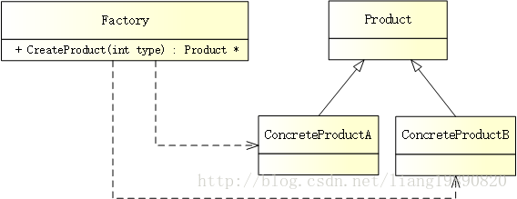

# 简单工厂模式

## 简述
> 简单工厂模式（Simple Factory Pattern）又叫做静态工厂方法模式（Static Factory Method Pattern），属于创建型模式。简单工厂模式的实质是由一个工厂类根据传入的参数，动态决定应该创建哪一个产品类的实例。

值得注意的是，简单工厂模式并不属于 23 种 GoF 设计模式之一。它是工厂模式家族中最简单实用的模式，可以理解为是不同工厂模式的一个特殊实现。

## 模式结构

 

UML 结构图：




- 工厂（Factory）：整个模式的核心，负责实现创建所有实例的内部逻辑。
- 抽象产品（Product）：所有具体产品的父类，负责描述所有实例所共有的公共接口。
- 具体产品（ConcreteProduct）：最终创建的具体产品

## 优缺点
优点：

- 工厂类包含了必要的逻辑判断，根据指定的信息来创建对应的产品。客户端仅负责“消费”产品即可，实现了对象创建和使用的分离。
- 客户端无需关心具体产品如何创建与组织，仅需知道具体产品所对应的参数即可，可以在一定程度减少使用者的记忆量。

缺点：

- 由于工厂类集中了所有产品的创建逻辑（违反了高内聚责任分配原则），职责过重，一旦无法正常工作，整个系统都将受到影响。
- 一旦添加新产品就不得不修改工厂逻辑，在产品类型较多时，有可能造成工厂逻辑过于复杂，不利于系统的扩展和维护。
这些缺点在 ***C++工厂方法模式*** 中得到了一定的克服。

## 适用场景
- 工厂类负责创建的对象比较少（不会造成工厂方法中的业务逻辑太过复杂）。
- 客户端仅需知道传入工厂类的参数，对于如何创建对象（逻辑）不关心。
PS： 由于简单工厂很容易违反高内聚责任分配原则，因此一般只在很简单的情况下应用。

## 案例分析
BBA - 奔驰、宝马、奥迪

互联网行业有三巨头 BAT，汽车界也有三大豪门 BBA - 奔驰、宝马、奥迪。他们是驰名世界的汽车企业，也被认为是高档汽车生产的先导，最可怕的是均属于德国制造。奔驰优雅稳重、宝马操控感强、奥迪大气，更是官车的代表。。。“坐奔驰，开宝马”，足以说明一切。在国内，BBA 大受欢迎，对很多人来说，不仅是代步工具，更是身份的象征。

车再好，也需要在工厂中加工生产，来一起看看简单工厂模式吧！

代码实现
创建抽象产品

示例中，需要有一个汽车产品 - ICar：
```cpp
// product.h
#ifndef PRODUCT_H
#define PRODUCT_H

#include <string>

using namespace std;

// 汽车接口
class ICar
{
public:
    virtual string Name() = 0;  // 汽车名称
};

#endif // PRODUCT_H
```
创建具体产品

模型有了，来创建一些具体的汽车：
```cpp
// concrete_product.h
#ifndef CONCRETE_PRODUCT_H
#define CONCRETE_PRODUCT_H

#include "product.h"

// 奔驰汽车
class BenzCar : public ICar
{
public:
    string Name() {
        return "Benz Car";
    }
};

// 宝马汽车
class BmwCar : public ICar
{
public:
    string Name() {
        return "Bmw Car";
    }
};

// 奥迪汽车
class AudiCar : public ICar
{
public:
    string Name() {
        return "Audi Car";
    }
};

#endif // CONCRETE_PRODUCT_H
```
创建工厂

要生产汽车，需要有相应的工厂：
```cpp
// factory.h
#ifndef FACTORY_H
#define FACTORY_H

#include "concrete_product.h"

// 工厂
class Factory
{
public:
    enum CAR_TYPE {
       BENZ_CAR,  // 奔驰汽车
       BMW_CAR,  // 宝马汽车
       AUDI_CAR  // 奥迪汽车
    };

    // 生产汽车
    ICar* CreateCar(CAR_TYPE type) {
        ICar *pCar = NULL;
        switch(type) {
        case CAR_TYPE::BENZ_CAR:
            pCar = new BenzCar();  // 奔驰汽车
            break;
        case CAR_TYPE::BMW_CAR:
            pCar = new BmwCar();  // 宝马汽车
            break;
        case CAR_TYPE::AUDI_CAR:
            pCar = new AudiCar();  // 奥迪汽车
            break;
        default:
            break;
        }
        return pCar;
    }
};

#endif // FACTORY_H
```

这样以来，工厂就可以根据汽车类型来生产对应的汽车了。

创建客户端

当一切准备就绪，就可以实现客户端了：
```cpp
// main.cpp
#include "factory.h"
#include "product.h"
#include <iostream>

#ifndef SAFE_DELETE
#define SAFE_DELETE(p) { if(p){delete(p); (p)=NULL;} }
#endif

int main()
{
    // 工厂
    Factory *pFactory = new Factory();

    // 奔驰汽车
    ICar *pCar = pFactory->CreateCar(Factory::BENZ_CAR);
    cout << pCar->Name() << endl;
    
    SAFE_DELETE(pCar);
    
    // 宝马汽车
    pCar = pFactory->CreateCar(Factory::BMW_CAR);
    cout << pCar->Name() << endl;
    
    SAFE_DELETE(pCar);
    
    // 奥迪汽车
    pCar = pFactory->CreateCar(Factory::AUDI_CAR);
    cout << pCar->Name() << endl;
    
    SAFE_DELETE(pCar);
    
    getchar();
    
    return 0;
}
```
输出如下：
```
Benz Car 
Bmw Car 
Audi Car
```
