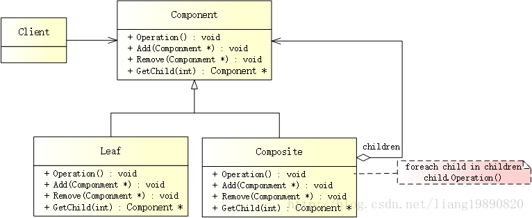
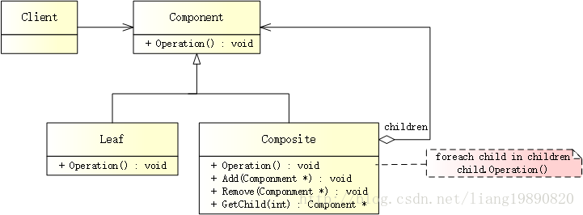
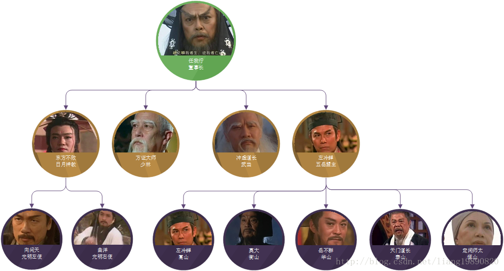

# 组合模式

## 简述
组合模式（Composite Pattern）组合多个对象形成树形结构以表示具有“整体-部分”关系的层次结构。组合模式对单个对象（即：叶子构件）和组合对象（即：容器构件）的使用具有一致性，组合模式又被称为“整体-部分”（Part-Whole）模式，属于对象结构型模式。


## 模式结构
UML 结构图（透明组合模式）：



UML 结构图（安全组合模式）：



- Component（抽象构件）：为叶子构件和容器构件对象定义接口，可以包含所有子类共有行为的声明和实现。在抽象构件中，声明了访问及管理子构件的接口（例如：Add()、Remove()、GetChild() 等）。
- Leaf（叶子构件）：叶子节点没有子节点。它实现了 Component 中定义的行为，对于访问及管理子构件的接口，可以通过异常等方式进行处理。
- Composite（容器构件）：容器节点包含子节点（可以是叶子构件，也可以是容器构件）。它提供了一个集合用于存储子节点，实现了 Component 中定义的行为，包括访问及管理子构件的接口，在其业务方法中可以递归调用其子节点的业务方法。


## 透明组合模式和安全组合模式

根据 Component 的定义形式，可将组合模式分为两种形式：

- 透明组合模式
- 安全组合模式


透明组合模式包含以下特点：

- 在 Component 中定义了用于访问和管理子构建的接口，这样做的好处是确保所有的构件类都有相同的接口。
- 在 Client 看来，Leaf 与 Composite 所提供的接口一致，Client 可以相同地对待所有的对象。


安全组合模式包含以下特点：

- 在 Component 中不定义任何用于访问和管理子构建的接口，而在 Composite 中声明并实现。
这种做法是安全的，因为不需要向 Leaf 提供这些管理成员对象的接口，对于 Leaf 来说，Client 不可能调用到这些接口。
- 透明组合模式的缺点是不够安全，因为 Leaf 和 Composite 在本质上是有区别的。Leaf 不可能有下一个层级，因此为其提供 Add()、Remove()、GetChild() 等接口没有意义。这在编译阶段不会出错，但在运行阶段如果调用这些接口可能会出错（如果没有提供相应的异常处理）。

- 安全组合模式的缺点是不够透明，因为 Leaf 和 Composite 具有不同的接口，且 Composite 中那些用于访问和管理子构建的接口没有在 Component 中定义，因此 Client 不能完全针对抽象编程，必须有区别地对待 Leaf 和 Composite。

PS： 透明组合模式是组合模式的标准形式，但在实际应用中，安全组合模式的使用频率也非常高。

## 优缺点
优点：

- 组合模式可以清楚地定义分层次的复杂对象，表示对象的全部或部分层次，它让 Client 忽略了层次的差异，方便对整个层次结构进行控制。
- Client 可以一致地使用一个组合结构或其中单个对象，不必关心处理的是单个对象还是整个组合结构，简化了 Client 的代码。
- 在组合模式中，增加新的叶子构件和容器构件很方便，无须对现有类进行任何修改，符合“开闭原则”。
- 为树形结构提供了一种灵活的解决方案，通过递归组合容器对象和叶子对象，可以形成复杂的树形结构，但对树形结构的控制却非常简单。


缺点：

- 使设计变得更加抽象，对象的业务规则如果很复杂，则实现组合模式具有很大挑战性，而且不是所有的方法都与叶子对象子类都有关联。


适用场景
- 表示对象的“整体-部分”层次结构（树形结构）
- 希望用户忽略组合对象与单个对象的不同，统一地使用组合结构中的所有对象。


## 案例分析

只要有人的地方就有恩怨，有恩怨就会有江湖，人就是江湖！ 
– 金庸《笑傲江湖》



江湖公司由任我行一手创建，理所当然，他就是董事长。下设总经理一职，原本让令狐冲担任，却被婉拒，所以只能由自己兼任。再往下就是各事业部：日月神教、五岳剑派、以及其他门派等。

日月神教的头儿叫做教主（东方不败），底下有光明左右使、十大长老、堂主、舵主、香主等。

五岳剑派的头儿叫做盟主（左冷蝉），各派分别为：嵩山（左冷蝉）、泰山（天门道长）、衡山（莫大）、华山（岳不群）、恒山（定闲师太），各头目被称为掌门。

另外，还有一些很 NB 的部门，不仅历史悠久，而且威望超高，是武林中的泰山北斗：少林（方证大师）、武当（冲虚道长）。。。

## 代码实现

### 透明组合模式
创建抽象构件

Component 需要定义访问及管理子构件的接口：
```cpp
// component.h
#ifndef COMPONENT_H
#define COMPONENT_H

#include <iostream>
#include <string>

using namespace std;

class Component
{
public:
    Component(string name) : m_strName(name) {}
    virtual ~Component() {}
    virtual void Add(Component *cmpt) = 0;  // 添加构件
    virtual void Remove(Component *cmpt) = 0;  // 删除构件
    virtual Component* GetChild(int index) = 0;  // 获取构件
    virtual void Operation(int indent) = 0;  // 显示构件（以缩进的方式）

private:
    Component();  // 不允许

protected:
    string m_strName;
};

#endif // COMPONENT_H
```

创建叶子构件

作为 Component 的子类，Leaf 需要实现 Component 中定义的所有接口，但是 Leaf 不能包含子构件。因此，在 Leaf 中实现访问和管理子构件的函数时，需要进行异常处理或错误提示。 当然，这无疑会给 Leaf 的实现带来麻烦。
```cpp
// leaf.h
#ifndef LEAF_H
#define LEAF_H

#include "component.h"

class Leaf : public Component
{
public:
    Leaf(string name) : Component(name){}
    virtual ~Leaf(){}
    void Add(Component *cmpt) {
        cout << "Can't add to a Leaf" << endl;
    }
    void Remove(Component *cmpt) {
        cout << "Can't remove from a Leaf" << endl;
    }
    Component* GetChild(int index) {
        cout << "Can't get child from a Leaf" << endl;
        return NULL;
    }
    void Operation(int indent) {
        string newStr(indent, '-');
        cout << newStr << " " << m_strName <<endl;
    }

private:
    Leaf();  // 不允许
};

#endif // LEAF_H
```

创建容器构件

由于容器构件中可以包含子节点，因此对容器构件进行处理时可以使用递归方式。
```cpp
// composite.h
#ifndef COMPOSITE_H
#define COMPOSITE_H

#include <vector>
#include "component.h"

#ifndef SAFE_DELETE
#define SAFE_DELETE(p) { if(p){delete(p); (p)=NULL;} }
#endif

class Composite : public Component
{
public:
    Composite (string name) : Component(name) {}
    virtual ~Composite() {
        while (!m_elements.empty()) {
            vector<Component*>::iterator it = m_elements.begin();
            SAFE_DELETE(*it);
            m_elements.erase(it);
        }
    }
    void Add(Component *cmpt) {
        m_elements.push_back(cmpt);
    }
    void Remove(Component *cmpt) {
        vector<Component*>::iterator it = m_elements.begin();
        while (it != m_elements.end())  {
            if (*it == cmpt) {
                SAFE_DELETE(cmpt);
                m_elements.erase(it);
                break;
            }
            ++it;
        }
    }
    Component* GetChild(int index) {
        if (index >= m_elements.size())
            return NULL;

        return m_elements[index];
    }
    // 递归显示
    void Operation(int indent) {
        string newStr(indent, '-');
        cout << newStr << "+ " << m_strName << endl;
        // 显示每个节点的孩子
        vector<Component*>::iterator it = m_elements.begin();
        while (it != m_elements.end()) {
            (*it)->Operation(indent + 2);
            ++it;
        }
    }

private:
    Composite();  // 不允许

private:
    vector<Component *> m_elements;
};

#endif // COMPOSITE_H
```

创建客户端

最终，来看看任大教主的组织结构：
```cpp
// main.cpp
#include "composite.h"
#include "leaf.h"

int main()
{
    // 创建一个树形结构
    // 创建根节点
    Component *pRoot = new Composite("江湖公司（任我行）");

    // 创建分支
    Component *pDepart1 = new Composite("日月神教（东方不败）");
    pDepart1->Add(new Leaf("光明左使（向问天）"));
    pDepart1->Add(new Leaf("光明右使（曲洋）"));
    pRoot->Add(pDepart1);
    
    Component *pDepart2 = new Composite("五岳剑派（左冷蝉）");
    pDepart2->Add(new Leaf("嵩山（左冷蝉）"));
    pDepart2->Add(new Leaf("衡山（莫大）"));
    pDepart2->Add(new Leaf("华山（岳不群）"));
    pDepart2->Add(new Leaf("泰山（天门道长）"));
    pDepart2->Add(new Leaf("恒山（定闲师太）"));
    pRoot->Add(pDepart2);
    
    // 添加和删除叶子
    pRoot->Add(new Leaf("少林（方证大师）"));
    pRoot->Add(new Leaf("武当（冲虚道长）"));
    Component *pLeaf = new Leaf("青城（余沧海）");
    pRoot->Add(pLeaf);
    
    // 小丑，直接裁掉
    pRoot->Remove(pLeaf);
    
    // 递归地显示组织架构
    pRoot->Operation(1);
    
    // 删除分配的内存
    SAFE_DELETE(pRoot);
    
    getchar();
    
    return 0;
}
```
输出如下：
```
-+ 江湖公司（任我行） 
—+ 日月神教（东方不败） 
—– 光明左使（向问天） 
—– 光明右使（曲洋） 
—+ 五岳剑派（左冷蝉） 
—– 嵩山（左冷蝉） 
—– 衡山（莫大） 
—– 华山（岳不群） 
—– 泰山（天门道长） 
—– 恒山（定闲师太） 
— 少林（方证大师） 
— 武当（冲虚道长）
```
安全组合模式
创建抽象构件
```cpp
// component.h
#ifndef COMPONENT_H
#define COMPONENT_H

#include <iostream>
#include <string>

using namespace std;

class Component
{
public:
    Component(string name) : m_strName(name) {}
    virtual ~Component() {}
    virtual void Operation(int indent) = 0;  // 显示构件（以缩进的方式）

private:
    Component();  // 不允许

protected:
    string m_strName;
};

#endif // COMPONENT_H
```

创建叶子构件
```cpp
// leaf.h
#ifndef LEAF_H
#define LEAF_H

#include "component.h"

class Leaf : public Component
{
public:
    Leaf(string name) : Component(name){}
    virtual ~Leaf(){}
    void Operation(int indent) {
        string newStr(indent, '-');
        cout << newStr << " " << m_strName <<endl;
    }

private:
    Leaf();  // 不允许
};

#endif // LEAF_H
```

注意： 与透明模式不同，这里已经没有了访问及管理子构件的接口，所有的接口都在 Composite 中，不再赘述（同上）。
