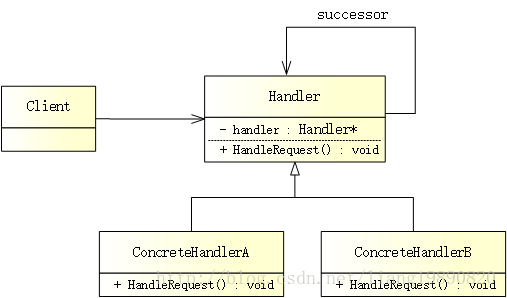

# 职责链模式


# 简述

职责链模式（Chain of Responsibility Pattern）使多个对象都有机会处理请求，从而避免请求的发送者和接收者之间的耦合关系。将这些对象连成一条链，并沿着这条链传递该请求，直到有一个对象处理它为止。

**|** 版权声明：一去、二三里，未经博主允许不得转载。

# 模式结构

UML 结构图：



- Handler（抽象处理者）：定义了处理请求所需的接口。
- ConcreteHandler（具体处理者）：处理自己负责的请求，如果无法处理，则将请求传递给与之保持联系的后继者（即：successor）。
- Client（客户端）：请求的发起者，将访问 Handler 来处理它。

# 优缺点

优点：

- 降低耦合度，将请求的发送者和接收者解耦。
- 简化了对象，使得对象不需要知道链的结构。
- 增强给对象指派职责的灵活性，通过改变链内的成员或者调整它们的次序来动态改变职责。
- 增加新的具体处理者很方便，无须修改原有代码，只需要在客户端重新建链即可。

缺点：

- 由于没有明确的接收者，所以无法保证请求一定会被处理（可能直到链的末端都得不到处理，也可能因为链没有配置正确而得不到处理。）
- 对于较长的职责链来说，请求可能涉及到多个处理对象，这将会使系统性能受到一定影响，而且不利于代码调试。
- 如果建链不当，可能会造成循环调用，这将导致系统陷入死循环。

# 适用场景

- 有多个对象可以处理同一请求，具体哪个对象处理由运行时刻自动确定。客户端只负责提交请求，而无须关心请求的处理对象是谁以及它是如何处理的。
- 在不明确指定接受者的情况下，向多个对象中的一个提交一个请求。
- 可动态指定一组对象处理请求，客户端可以动态创建职责链来处理请求，还可以改变链中处理者之间的先后次序。

# 案例分析

> 请假 - 流程处理


混迹职场，从来都身不由己，谁不想在繁忙的工作里偷得浮生半日闲。但请假从来都是一门技术活，拼技术，更拼情商！

无论如何，只要你愿意，从感冒到被绑架，一定能找出一万种理由：

- 自我诅咒版：感冒、发烧、肠胃炎 …
- 俗套肥皂剧：飞机延误、火车晚点、家里遭窃 …
- 大打感情牌：看望父母、失恋了 …
- 积劳成疾可怜版：工作压力太大、加班累坏了 …
- 无需理由的理由：老板，我是不是有 5 天年假？

彪悍的人生不需要解释，如果没有过这种请假经历，就不是职场老司机。。。

当员工发出请假请求时，链中的处理者可以对请求作出响应或者将其传递给上级。每个处理者都有自己的一套规则，而这套规则是他们可以批准的。审批流程：经理（1 天及以下） -> 总监（3 天及以下） -> 总裁（7 天为界限）。

# 代码实现

**创建抽象处理者**

抽象处理者除了提供一个处理请假的接口之外，还有一个很关键的地方就是定义后继者，这样便可以构建一条链：

```C++
// handler.h
#ifndef HANDLER_H
#define HANDLER_H

#include <iostream>

// 抽象处理者
class IHandler
{
public:
    IHandler() { m_pSuccessor = NULL; }
    virtual ~IHandler() {}
    void SetSuccessor(IHandler *successor) { m_pSuccessor = successor; }
    virtual void HandleRequest(float days) = 0;

protected:
    IHandler *m_pSuccessor;  // 后继者
};

#endif // HANDLER_H
```

**创建具体处理者**

具体处理者包含 Manager、Director、CEO，它们的实现基本相同，只是批准的天数不一样：

```C++
// concrete_handler.h
#ifndef CONCRETE_HANDLER_H
#define CONCRETE_HANDLER_H

#include "handler.h"

// 经理
class Manager : public IHandler
{
public:
    Manager() {}
    ~Manager() {}
    virtual void HandleRequest(float days) override {
        if (days <= 1) {
            std::cout << "Manager 批准了 " << days << " 天假" << std::endl;
        } else {
            m_pSuccessor->HandleRequest(days);
        }
    }
};

// 总监
class Director : public IHandler
{
public:
    Director() {}
    ~Director() {}
    virtual void HandleRequest(float days) override {
        if (days <= 3) {
            std::cout << "Director 批准了 " << days << " 天假" << std::endl;
        } else {
            m_pSuccessor->HandleRequest(days);
        }
    }
};

// 总裁
class CEO : public IHandler
{
public:
    CEO() {}
    ~CEO() {}
    virtual void HandleRequest(float days) override {
        if (days <= 7) {
            std::cout << "CEO 批准了 " << days << " 天假" << std::endl;
        } else {
            std::cout << "给你放长假，以后不用来上班啦！" << std::endl;
        }
    }
};

#endif // CONCRETE_HANDLER_H
```

**注意：** 由于 CEO 位于最高层（处于链的末尾），所以请求到此结束，不会继续向下传递。

**创建客户端**

开始请假，说出你的理由：

```C++
// main.cpp
#include "concrete_handler.h"

#ifndef SAFE_DELETE
#define SAFE_DELETE(p) { if(p){delete(p); (p)=NULL;} }
#endif

int main()
{
    IHandler *manager = new Manager();
    IHandler *director = new Director();
    IHandler *ceo = new CEO();

    // 职责链：经理 -> 总监 -> 总裁
    manager->SetSuccessor(director);
    director->SetSuccessor(ceo);

    manager->HandleRequest(1);
    manager->HandleRequest(2);
    manager->HandleRequest(5);
    manager->HandleRequest(10);

    SAFE_DELETE(manager);
    SAFE_DELETE(director);
    SAFE_DELETE(ceo);

    getchar();

    return 0;
}
```

输出如下：

> Manager 批准了 1 天假 
> Director 批准了 2 天假 
> CEO 批准了 5 天假 
> 给你放长假，以后不用来上班啦！

