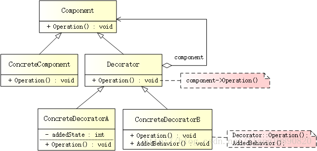

# 装饰者模式

## 简述

> 装饰者模式（Decorator Pattern）是在不必改变原类文件和使用继承的情况下，动态地扩展一个对象的功能。它是通过创建一个包装对象，也就是装饰来包裹真实的对象。

## 模式结构
UML 结构图：




- Component（抽象构件）：给出一个抽象接口，以规范准备接收附加责任的对象。
- ConcreteComponent（具体构件）：定义一个将要接收附加责任的类。
- Decorator（抽象装饰类）：持有一个构件（Component）对象的实例，并实现一个与抽象构件接口一致的接口。
- ConcreteDecorator（具体装饰类）：负责给构件对象添加上附加的责任。


## 优缺点
优点：

- Decorator 模式与继承关系的目的都是要扩展对象的功能，但是 Decorator 可以提供比继承更多的灵活性。
- 通过使用不同的具体装饰类以及这些装饰类的排列组合，可以创造出很多不同行为的组合。

缺点：

- 这种比继承更加灵活机动的特性，也同时意味着更加多的复杂性。
- 装饰模式会导致设计中出现许多小类，如果过度使用，会使程序变得很复杂。
- 装饰模式是针对抽象构建（Component）类型编程。但是，如果要针对具体构件（ConcreteComponent）编程，应该重新思考应用架构，以及装饰者是否合适。当然也可改变 Component 接口，增加新的公开的行为，实现“半透明”的装饰者模式。在实际项目中要做出最佳选择。

适用场景

- 需要扩展一个类的功能，或给一个类添加附加职责。
- 需要动态的给一个对象添加功能，这些功能可以再动态的撤销。
- 需要增加由一些基本功能的排列组合而产生的非常大量的功能，从而使继承关系变的不现实。
- 当不能采用生成子类的方法进行扩充时。一种情况是，可能有大量独立的扩展，为支持每一种组合将产生大量的子类，使得子类数目呈爆炸性增长。另一种情况可能是因为类定义被隐藏，或类定义不能用于生成子类。

## 案例分析

星巴克（Starbucks）

在星巴克购买咖啡时，可以要求在其中加入各种调味品（辅料）。调味品很多，有些不收费（例如：白砂糖、香草粉等），有些则需要额外收费（例如：奶油、摩卡、糖浆等），所以充分利用起来吧！倘若咖啡不带劲，我们想要添加奶油、摩卡和糖浆，这时，就可以利用装饰者模式思想来实现。

关于星巴克，推荐两个比较火的事件：

老罗星巴克奇遇记（看一次笑十次 ~O(∩_∩)O~）
《致星巴克中国CEO王静瑛公开信：什么时候才不觉得中杯顾客无知或愚蠢?》

代码实现

创建构建

首先，定义所有饮料的基类，并提供名称和价钱：
```cpp 
// component.h
#ifndef COMPONENT_H
#define COMPONENT_H

#include <string>

using namespace std;

// 所有饮料的基类
class IBeverage
{
public:
    virtual string Name() = 0;  // 名称
    virtual double Cost() = 0;  // 价钱
};

#endif // COMPONENT_H
```

创建具体构建

假设，有两款具体的咖啡 - 黑咖啡（属于混合咖啡）和深度烘培咖啡豆：
```cpp
// concrete_component.h
#ifndef CONCRETE_COMPONENT_H
#define CONCRETE_COMPONENT_H

#include "component.h"

/********** 具体的饮料（咖啡）**********/

// 黑咖啡，属于混合咖啡
class HouseBlend : public IBeverage
{
public:
    string Name() {
        return "HouseBlend";
    }

    double Cost() {
        return 30.0;
    }
};

// 深度烘培咖啡豆
class DarkRoast : public IBeverage
{
public:
    string Name() {
        return "DarkRoast";
    }

    double Cost() {
        return 28.5;
    }
};

#endif // CONCRETE_COMPONENT_H
```

创建装饰

咖啡有了，剩下的就是添加调味品，其同样继承 IBeverage，并持有咖啡的实例：
```cpp
// decorator.h
#ifndef DECORATOR_H
#define DECORATOR_H

#include "component.h"

// 调味品
class CondimentDecorator : public IBeverage
{
public :
    CondimentDecorator(IBeverage *beverage) : m_pBeverage(beverage) {}

    string Name() {
        return m_pBeverage->Name();
    }
    
    double Cost() {
        return m_pBeverage->Cost();
    }

protected :
    IBeverage *m_pBeverage;
} ;

#endif // DECORATOR_H
```
创建具体装饰

添加三种收费的调味品：
```cpp
// concrete_decorator.h
#ifndef CONCRETE_DECORATOR_H
#define CONCRETE_DECORATOR_H

#include "decorator.h"

/********** 具体的饮料（调味品）**********/

// 奶油
class Cream : public CondimentDecorator
{
public:
    Cream(IBeverage *beverage) : CondimentDecorator(beverage) {}

    string Name() {
        return m_pBeverage->Name() + " Cream";
    }
    
    double Cost() {
        return m_pBeverage->Cost() + 3.5;
    }
};

// 摩卡
class Mocha : public CondimentDecorator
{
public:
    Mocha(IBeverage *beverage) : CondimentDecorator(beverage) {}

    string Name() {
        return m_pBeverage->Name() + " Mocha";
    }
    
    double Cost() {
        return m_pBeverage->Cost() + 2.0;
    }
};

// 糖浆
class Syrup : public CondimentDecorator
{
public:
    Syrup(IBeverage *beverage) : CondimentDecorator(beverage) {}

    string Name() {
        return m_pBeverage->Name() + " Syrup";
    }
    
    double Cost() {
        return m_pBeverage->Cost() + 3.0;
    }
};

#endif // CONCRETE_DECORATOR_H
```

创建客户端

最终，我们可以为咖啡添加相应的调味品：
```cpp
// main.cpp
#include "concrete_component.h"
#include "concrete_decorator.h"
#include <iostream>

#ifndef SAFE_DELETE
#define SAFE_DELETE(p) { if(p){delete(p); (p)=NULL;} }
#endif

int main()
{
    /********** 黑咖啡 **********/
    IBeverage *pHouseBlend = new HouseBlend();
    cout << pHouseBlend->Name() << " : " << pHouseBlend->Cost() << endl;

    // 黑咖啡 + 奶油
    CondimentDecorator *pCream = new Cream(pHouseBlend);
    cout << pCream->Name() << " : " << pCream->Cost() << endl;
    
    // 黑咖啡 + 摩卡
    CondimentDecorator *pMocha = new Mocha(pHouseBlend);
    cout << pMocha->Name() << " : " << pMocha->Cost() << endl;
    
    // 黑咖啡 + 糖浆
    CondimentDecorator *pSyrup = new Syrup(pHouseBlend);
    cout << pSyrup->Name() << " : " << pSyrup->Cost() << endl;
    
    /********** 深度烘培咖啡豆 **********/
    IBeverage *pDarkRoast = new DarkRoast();
    cout << pDarkRoast->Name() << " : " << pDarkRoast->Cost() << endl;
    
    // 深度烘培咖啡豆 + 奶油
    CondimentDecorator *pCreamDR = new Cream(pDarkRoast);
    cout << pCreamDR->Name() << " : " << pCreamDR->Cost() << endl;
    
    // 深度烘培咖啡豆 + 奶油 + 摩卡
    CondimentDecorator *pCreamMocha = new Mocha(pCreamDR);
    cout << pCreamMocha->Name() << " : " << pCreamMocha->Cost() << endl;
    
    // 深度烘培咖啡豆 + 奶油 + 摩卡 + 糖浆
    CondimentDecorator *pCreamMochaSyrup = new Syrup(pCreamMocha);
    cout << pCreamMochaSyrup->Name() << " : " << pCreamMochaSyrup->Cost() << endl;
    
    SAFE_DELETE(pSyrup);
    SAFE_DELETE(pMocha);
    SAFE_DELETE(pCream);
    SAFE_DELETE(pHouseBlend);
    
    SAFE_DELETE(pCreamMochaSyrup);
    SAFE_DELETE(pCreamMocha);
    SAFE_DELETE(pCreamDR);
    SAFE_DELETE(pDarkRoast);
    
    getchar();
    
    return 0;
}
```
输出如下：

HouseBlend : 30 
HouseBlend Cream : 33.5 
HouseBlend Mocha : 32 
HouseBlend Syrup : 33 
DarkRoast : 28.5 
DarkRoast Cream : 32 
DarkRoast Cream Mocha : 34 
DarkRoast Cream Mocha Syrup : 37

调味品可以随便组合，甚至同一调味品可以添加多份（例如：来 三份糖浆）或者同时添加奶、摩卡和糖浆。


