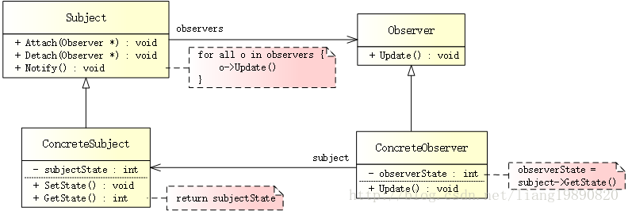

# 观察者模式

## 简述
> 观察者模式（Observer Pattern），定义了对象间的一对多的依赖关系，让多个观察者对象同时监听某一个主题对象（被观察者）。当主题对象的状态发生更改时，会通知所有观察者，让它们能够自动更新。


背景
很多时候，在应用程序的一部分发生更改时，需要同时更新应用程序的其他部分。有一种方法是：让接收者反复检查发送者来进行更新，但是这种方法存在两个主要问题：

占用大量的 CPU 时间来检查新的状态
依赖于检测更新的时间间隔，可能不会立即获得更新
对于这个问题，有一个简单的解决方案 - 观察者模式。

## 模式结构
UML 结构图：



- Subject（抽象主题）：跟踪所有观察者，并提供添加和删除观察者的接口。
- Observer（抽象观察者）：为所有的具体观察者定义一个接口，在得到主题的通知时进行自我更新。
- ConcreteSubject（具体主题）：将有关状态存入各 ConcreteObserver 对象。当具体主题的状态发生任何更改时，通知所有观察者。
- ConcreteObserver（具体观察者）：实现 Observer 所要求的更新接口，以便使本身的状态与主题的状态相协调。

## 优缺点
优点：

- 观察者和被观察者是抽象耦合的
- 建立一套触发机制

缺点：

- 如果一个被观察者对象有很多的直接和间接的观察者，将所有的观察者都通知到会花费很多时间。
- 如果在观察者和观察目标之间有循环依赖的话，观察目标会触发它们之间进行循环调用，可能导致系统崩溃。
- 观察者模式没有相应的机制让观察者知道所观察的目标对象是怎么发生变化的，而仅仅只是知道观察目标发生了变化。

适用场景
- 有多个子类共有的方法，且逻辑相同。
- 重要的、复杂的方法，可以考虑作为模板方法。

## 案例分析
滴滴一下，让出行更美好

自从有了滴滴、快滴、Uber、神舟等各大打车平台，广大市民的出行便利了不少。但自从合并以后，补助少了，价格也上涨了很多，不 * XX 倍甚至打不到车。。。

滴滴：好，第一个月，价格上调至 12.5。。。 
过了不久，心里想着：纳尼，都垄断了，还不多涨涨，果断 15.0。。。

合并就是为了垄断，再无硝烟四起的价格战，整合成统一价格模式，用户也就没有了自由选择权。


在这里，滴滴相当于主题，司机相当于观察者。

代码实现
创建抽象主题

提供关于注册、注销、通知观察者的接口：
```cpp
// subject.h
#ifndef SUBJECT_H
#define SUBJECT_H

class IObserver;

// 抽象主题
class ISubject
{
public:
    virtual void Attach(IObserver *) = 0;  // 注册观察者
    virtual void Detach(IObserver *) = 0;  // 注销观察者
    virtual void Notify() = 0;  // 通知观察者
};

#endif // SUBJECT_H
```

创建具体主题

抽象主题的具体实现，用于管理所有的观察者：
```cpp
// concrete_subject.h
#ifndef CONCRETE_SUBJECT_H
#define CONCRETE_SUBJECT_H

#include "subject.h"
#include "observer.h"
#include <iostream>
#include <list>

using namespace std;

// 具体主题
class ConcreteSubject : public ISubject
{
public:
    ConcreteSubject() { m_fPrice = 10.0; }

    void SetPrice(float price) {
        m_fPrice = price;
    }
    
    void Attach(IObserver *observer) {
        m_observers.push_back(observer);
    }
    
    void Detach(IObserver *observer) {
        m_observers.remove(observer);
    }
    
    void Notify() {
        list<IObserver *>::iterator it = m_observers.begin();
        while (it != m_observers.end()) {
            (*it)->Update(m_fPrice);
            ++it;
        }
    }

private:
    list<IObserver *> m_observers;  // 观察者列表
    float m_fPrice;  // 价格
};

#endif // CONCRETE_SUBJECT_H
```


创建抽象观察者

提供一个 Update() 接口，用于更新价格：
```cpp
// observer.h
#ifndef OBSERVER_H
#define OBSERVER_H

// 抽象观察者
class IObserver
{
public:
    virtual void Update(float price) = 0;  // 更新价格
};

#endif // OBSERVER_H
```
创建具体观察者

抽象观察者的具体实现，当接收到通知后，调整对应的价格：
```
// concrete_observer.h
#ifndef CONCRETE_OBSERVER_H
#define CONCRETE_OBSERVER_H

#include "observer.h"
#include <iostream>
#include <string>

using namespace std;

// 具体观察者
class ConcreteObserver : public IObserver
{
public:
    ConcreteObserver(string name) { m_strName = name; }

    void Update(float price) {
        cout << m_strName << " - price: " << price << "\n";
    }

private:
     string m_strName;  // 名字
};

#endif // CONCRETE_OBSERVER_H
```


创建客户端

创建主题以及对应的观察者，并添加观察者并更新价格：
```cpp
// main.cpp
#include "concrete_subject.h"
#include "concrete_observer.h"

#ifndef SAFE_DELETE
#define SAFE_DELETE(p) { if(p){delete(p); (p)=NULL;} }
#endif

int main()
{
    // 创建主题、观察者
    ConcreteSubject *pSubject = new ConcreteSubject();
    IObserver *pObserver1 = new ConcreteObserver("Jack Ma");
    IObserver *pObserver2 = new ConcreteObserver("Pony");

    // 注册观察者
    pSubject->Attach(pObserver1);
    pSubject->Attach(pObserver2);
    
    // 更改价格，并通知观察者
    pSubject->SetPrice(12.5);
    pSubject->Notify();
    
    // 注销观察者
    pSubject->Detach(pObserver2);
    // 再次更改状态，并通知观察者
    pSubject->SetPrice(15.0);
    pSubject->Notify();
    
    SAFE_DELETE(pObserver1);
    SAFE_DELETE(pObserver2);
    SAFE_DELETE(pSubject);
    
    getchar();
    
    return 0;
}
```

输出如下：
```
Jack Ma - price: 12.5 
Pony - price: 12.5 
Jack Ma - price: 15
```
开始，我们创建了一个主题（滴滴）以及两个观察者（Jack Ma & Pony），通过 attach() 将他们加入至司机行列。调用 setPrice(12.5)，通知他们起步价为 12.5 元。后来呢，司机 Pony 由于种种原因（~O(∩_∩)O~大家都懂得）离职了 - detach() 注销。。。价格再次上调，涨、涨、涨 setPrice(15.0)。。。

