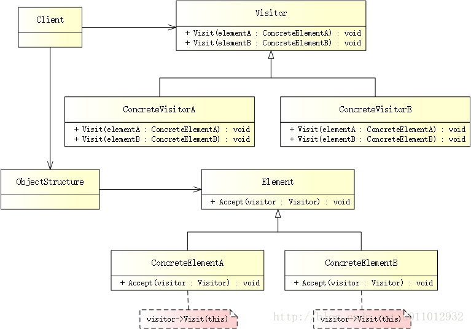
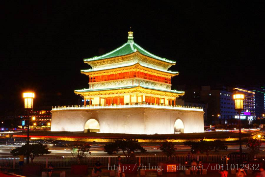

# 访问者模式


# 简述

访问者模式（Visitor Pattern）表示一个作用于某对象结构中的各元素的操作，它使你可以在不改变各元素类的前提下定义作用于这些元素的新操作。


# 模式结构

UML 结构图：



- Vistor（访问者）：为对象结构中每一个 ConcreteElement 声明一个 visit() 操作，从这个操作的名称或参数类型可以清楚知道需要访问的具体元素的类型。
- ConcreteVisitor（具体访问者）：实现每个由 Visitor 声明的操作。
- Element（元素）：定义一个 accept() 操作，它通常以一个 Vistor 作为参数。
- ConcreteElement（具体元素）：实现 accept() 操作，通过调用 Visitor 的 visit() 方法来实现对元素的访问。
- ObjectStructure（对象结构）：能够枚举它的元素，同时提供一个高层的接口，以允许访问者访问它的元素。

# 优缺点

优点：

- 增加新的访问操作很方便。使用访问者模式，增加新的访问操作就意味着增加一个新的具体访问者类，实现简单，无须修改源代码，符合“开闭原则”。
- 将有关元素对象的访问行为集中到一个访问者对象中，而不是分散在一个个的元素类中。类的职责更加清晰，有利于对象结构中元素对象的复用，相同的对象结构可以供多个不同的访问者访问。
- 让用户能够在不修改现有元素类层次结构的情况下，定义作用于该层次结构的操作。

缺点：

- 增加新的元素类困难。每增加一个新的元素类都意味着要在访问者中增加一个新的操作，并在每一个具体访问者类中增加相应的具体操作，这违背了“开闭原则”的要求。
- 破坏封装。访问者模式要求访问者对象访问并调用每一个元素对象的操作，这意味着元素对象有时候必须暴露一些自己的内部操作和内部状态，否则无法供访问者访问。

# 适用场景

- 一个对象结构包含多个类型的对象，希望对这些对象实施一些依赖其具体类型的操作。在访问者中针对每一种具体的类型都提供了一个访问操作，不同类型的对象可以有不同的访问操作。
- 需要对一个对象结构中的对象进行很多不同的并且不相关的操作，而需要避免让这些操作“污染”这些对象的类，也不希望在增加新操作时修改这些类。访问者模式使得我们可以将相关的访问操作集中起来定义在访问者类中，对象结构可以被多个不同的访问者类所使用，将对象本身与对象的访问操作分离。
- 对象结构中对象对应的类很少改变，但经常需要在此对象结构上定义新的操作。

# 案例分析

> 古城西安 - 访问记



西安历史悠久，有着 7000 多年文明史、3100 多年建城史、1100 多年的建都史，是中华文明和中华民族重要发祥地，丝绸之路的起点。。。西安与雅典、罗马、开罗并称为世界四大古都。

> 二十年中国看深圳，一百年中国看上海，一千年中国看北京，而五千年中国则看西安。

作为中国最佳的旅游胜地，西安有很多著名的景点：秦始皇兵马俑、大雁塔、大唐芙蓉园、华清池、钟/鼓楼、骊山、古城墙、历史博物馆。。。

在访问西安时，访问者会参观各个景点。对于景点来说，无论访问者是谁，它们都是不变的。而作为访问者，不同角色的访问方式也不尽相同，游客只负责旅游 - 吃喝玩乐，而清洁工则需要打扫卫生、清理垃圾。

这里，游客和清洁工是具体访问者，兵马俑、钟楼等景点是具体元素，西安这座城市是结构对象。

# 代码实现

**创建访问者**

访问者需要为每个景点都提供一个访问方法：

```C++
// visitor.h
#ifndef VISITOR_H
#define VISITOR_H

class BellTower;
class TerracottaWarriors;

// 访问者
class IVisitor
{
public:
    virtual ~IVisitor() {}
    virtual void Visit(BellTower *) = 0;
    virtual void Visit(TerracottaWarriors *) = 0;
};

#endif // VISITOR_H
```

**创建具体访问者**

具体访问者有两种 - 游客、清洁工，它们分别实现了不同的访问操作（游客只管吃喝玩乐，清洁工负责清理垃圾）：

```C++
// concrete_visitor.h
#ifndef CONCRETE_VISITOR_H
#define CONCRETE_VISITOR_H

#include "visitor.h"
#include "concrete_element.h"

// 游客
class Tourist : public IVisitor
{
public:
    virtual void Visit(BellTower *) override {
        std::cout << "I'm visiting the Bell Tower!" << std::endl;
    }

    virtual void Visit(TerracottaWarriors *) override {
        std::cout << "I'm visiting the Terracotta Warriors!" << std::endl;
    }
};

// 清洁工
class Cleaner : public IVisitor
{
public:
    virtual void Visit(BellTower *) override {
        std::cout << "I'm cleaning up the garbage of Bell Tower!" << std::endl;
    }

    virtual void Visit(TerracottaWarriors *) override {
        std::cout << "I'm cleaning up the garbage of Terracotta Warriors!" << std::endl;
    }
};

#endif // CONCRETE_VISITOR_H
```

**创建元素**

景点中定义了一个 Accept() 接口，用于接受访问者的访问：

```C++
// element.h
#ifndef ELEMENT_H
#define ELEMENT_H

class IVisitor;

// 地方
class IPlace
{
public:
    virtual ~IPlace() {}
    virtual void Accept(IVisitor *visitor) = 0;
};

#endif // ELEMENT_H
```

**创建具体元素**

具体元素有两个 - 钟楼、兵马俑，它们实现了 Accept() 方法：

```C++
// concrete_element.h
#ifndef CONCRETE_ELEMENT_H
#define CONCRETE_ELEMENT_H

#include "element.h"
#include "visitor.h"
#include <iostream>

// 钟楼
class BellTower : public IPlace
{
public:
    virtual void Accept(IVisitor *visitor) override {
        std::cout << "Bell Tower is accepting visitor." << std::endl;
        visitor->Visit(this);
    }
};

// 兵马俑
class TerracottaWarriors : public IPlace
{
public:
    virtual void Accept(IVisitor *visitor) override {
        std::cout << "Terracotta Warriors is accepting visitor." << std::endl;
        visitor->Visit(this);
    }
};

#endif // CONCRETE_ELEMENT_H
```

**注意：** 在 Accept() 方法中，通过调用 Visitor 的 visit() 方法（以当前对象为参数）来实现对景点的访问。

**创建对象结构**

添加景点，并为每一个景点添加访问者：

```C++
// object_structure.h
#ifndef OBJECT_STRUCTURE_H
#define OBJECT_STRUCTURE_H

#include "element.h"
#include <list>

// 城市（西安）
class City
{
public:
    void Attach(IPlace *place) {
        m_places.push_back(place);
    }

    void Detach(IPlace *place) {
        m_places.remove(place);
    }

    void Accept(IVisitor *visitor) {
        // 为每一个 element 设置 visitor，进行对应的操作
        for (std::list<IPlace*>::iterator it = m_places.begin(); it != m_places.end(); ++it) {
            (*it)->Accept(visitor);
        }
    }

private:
    std::list<IPlace *> m_places;
};

#endif // OBJECT_STRUCTURE_H
```

**创建客户端**

欢迎来到古城西安，开始访问之旅吧：

```C++
// main.cpp
#include "concrete_visitor.h"
#include "object_structure.h"

#ifndef SAFE_DELETE
#define SAFE_DELETE(p) { if(p){delete(p); (p)=NULL;} }
#endif

int main()
{
    City *city = new City();

    // 景点 - 钟楼、兵马俑
    IPlace *bellTower = new BellTower();
    IPlace *warriors = new TerracottaWarriors();

    // 访问者 - 游客、清洁工
    IVisitor *tourist = new Tourist();
    IVisitor *cleaner = new Cleaner();

    // 添加景点
    city->Attach(bellTower);
    city->Attach(warriors);

    // 接受访问
    city->Accept(tourist);
    city->Accept(cleaner);

    SAFE_DELETE(cleaner);
    SAFE_DELETE(tourist);
    SAFE_DELETE(warriors);
    SAFE_DELETE(bellTower);
    SAFE_DELETE(city);

    getchar();

    return 0;
}
```

输出如下：

> Bell Tower is accepting visitor. 
> I’m visiting the Bell Tower! 
> Terracotta Warriors is accepting visitor. 
> I’m visiting the Terracotta Warriors! 
> Bell Tower is accepting visitor. 
> I’m cleaning up the garbage of Bell Tower! 
> Terracotta Warriors is accepting visitor. 
> I’m cleaning up the garbage of Terracotta Warriors!

