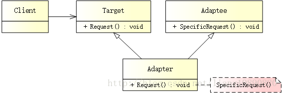
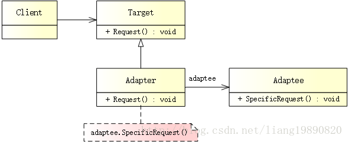

# 适配器模式

## 简述
> 适配器模式（Adapter Pattern）是一种补救模式，将一个类的接口转换成客户希望的另外一个接口，从而使原本由于接口不兼容而不能一起工作的类可以一起工作。


## 模式结构
UML 结构图（类适配器）：



UML 结构图（对象适配器）：



- Target（目标接口）：所期望得到的接口
- Adaptee（适配者）：需要适配的类
- Adapter（适配器）：该模式的核心，具有将 Adaptee 包装为 Target 的职责

## 类适配器和对象适配器
从实现层面上划分，适配器模式分为两种：

- 类适配器（多继承方式）
- 对象适配器（对象组合方式）
那么，实际应用中如何在二者之间进行选择？

类适配器包含以下特点：

由于 Adapter 直接继承自 Adaptee 类，所以，在 Adapter 类中可以对 Adaptee 类的方法进行重定义。
如果在 Adaptee 中添加了一个抽象方法，那么 Adapter 也要进行相应的改动，这样就带来高耦合。
如果 Adaptee 还有其它子类，而在 Adapter 中想调用 Adaptee 其它子类的方法时，使用类适配器是无法做到的。

对象适配器包含以下特点：

有的时候，你会发现，去构造一个 Adaptee 类型的对象不是很容易。
当 Adaptee 中添加新的抽象方法时，Adapter 类不需要做任何调整，也能正确的进行动作。
可以使用多态的方式在 Adapter 类中调用 Adaptee 类子类的方法。
由于对象适配器的耦合度比较低，所以在很多的书中都建议使用对象适配器。在我们实际项目中，也是如此，能使用对象组合的方式，就不使用多继承的方式。

## 优缺点
优点：

- 可以让任何两个没有关联的类一起运行
- 提高了类的复用
- 增加了类的透明度
- 灵活性好

缺点：

- 过多地使用适配器，会让系统非常零乱，不利于整体把控。
例如，看到调用的是 A 接口，内部却被适配成了 B 接口的实现，系统如果出现太多类似情况，无异于一场灾难。因此，如果不是很必要，可以不使用适配器，而是直接对系统进行重构。

适用场景
- 当想使用一个已存在的类，而它的接口不符合需求时。
- 你想创建一个可复用的类，该类可以与其他不相关的类或不可预见的类协同工作。
- 你想使用一些已经存在的子类，但是不可能对每一个都进行子类化以匹配它们的接口，对象适配器可以适配它的父接口。

## 案例分析
莫斯科 - 森林中的首都

莫斯科、圣彼得堡。。。作为俄罗斯的热门旅游景点，每年都会迎来成百上千万的游客，而中国稳居其第一大客源国。

要去俄罗斯旅游，手机必不可少，然而，让人头疼的是如何给手机充电！

世界各国插座标准都不尽相同，甚至同一国家的不同地区也可能不一样。例如，中国一般使用两脚扁型，而俄罗斯使用的是双脚圆形。那么，如果去俄罗斯旅游，就会出现一个问题：我们带去的充电器为两脚扁型，而他们提供的插座为双脚圆形，如何给手机充电呢？总不能为了旅客而随意更改墙上的插座吧，而且俄罗斯人一直都这么使用，并且用的很好。俗话说入乡随俗，那么只能自己想办法解决了。


其实这个问题的解决方式很简单 - 适配器模式，只需要提供一个电源转化器即可。该转化器的一端符合俄罗斯标准，可以插到俄罗斯的插座上，另一端符合中国标准，可以供我们的手机充电器使用。

## 代码实现
#### 对象适配器
创建目标接口

俄罗斯提供的插座：
```cpp
// target.h
#ifndef TARGET_H
#define TARGET_H

#include <iostream>

// 俄罗斯提供的插座
class IRussiaSocket
{
public:
    // 使用双脚圆形充电（暂不实现）
    virtual void Charge() = 0;
};

#endif // TARGET_H
```
创建适配者

再来看看我们自带的充电器：
```cpp
// adaptee.h
#ifndef ADAPTEE_H
#define ADAPTEE_H

#include <iostream>

using namespace std;

// 自带的充电器 - 两脚扁型
class OwnCharger
{
public:
    void ChargeWithFeetFlat() {
        cout << "OwnCharger::ChargeWithFeetFlat" << endl;
    }
};

#endif // ADAPTEE_H
```

创建适配器

定义一个电源适配器，并使用我们自带的充电器充电：
```cpp
// adapter.h
#ifndef ADAPTER_H
#define ADAPTER_H

#include "target.h"
#include "adaptee.h"

#ifndef SAFE_DELETE
#define SAFE_DELETE(p) { if(p){delete(p); (p)=NULL;} }
#endif

// 电源适配器
class PowerAdapter : public IRussiaSocket
{
public:
    PowerAdapter() : m_pCharger(new OwnCharger()){}
    ~PowerAdapter() {
        SAFE_DELETE(m_pCharger);
    }
    void Charge() {
        //  使用自带的充电器（两脚扁型）充电
        m_pCharger->ChargeWithFeetFlat();
    }

private:
    OwnCharger *m_pCharger;  // 持有需要被适配的接口对象 - 自带的充电器
};

#endif // ADAPTER_H
```
创建客户端

最终，客户端实现如下：
```cpp
// main.cpp
#include "adapter.h"

int main()
{
    // 创建适配器
    IRussiaSocket *pAdapter = new PowerAdapter();

    // 充电
    pAdapter->Charge();
    
    SAFE_DELETE(pAdapter);
    
    getchar();
    
    return 0;
}
```
输出如下：

OwnCharger::ChargeWithFeetFlat

这说明适配器起作用了，现在可以使用两脚扁型插孔充电了。我们并没有改变俄罗斯提供的插座，只提供了一个适配器就能使用中国的标准插口充电。这就是适配器模式的魅力：不改变原有接口，却还能使用新接口的功能。

#### 类适配器
Target 和 Adaptee 保持不变，只需要将 Adapter 变为多继承的方式即可：
```cpp
#ifndef ADAPTER_H
#define ADAPTER_H

#include "target.h"
#include "adaptee.h"

// 电源适配器
class PowerAdapter : public IRussiaSocket, OwnCharger
{
public:
    PowerAdapter() {}
    void Charge() {
        // 使用自带的充电器（两脚扁型）充电
        ChargeWithFeetFlat();
    }
};

#endif // ADAPTER_H
```
除此之外，其他用法和“对象适配器”一致。

